# hotel-booking-predictive-analytics
Predictive analytics project using hotel booking demand data, Jupyter notebooks, and Streamlit

## Table of Contents
1. [Project Overview](#project-overview)
2. [Dataset Content](#dataset-content)
3. [Business Requirements](#business-requirements)
4. [Hypotheses and Validation](#hypotheses-and-validation)
5. [Rationale to Map Business Requirements to Data Visualisations and ML Tasks](#rationale-to-map-business-requirements-to-data-visualisations-and-ml-tasks)
6. [ML Business Case](#ml-business-case)
7. [Dashboard Design](#dashboard-design)
8. [Features](#features)
9. [Technologies Used](#technologies-used)
10. [Agile Methodology](#agile-methodology)
11. [Testing](#testing)
12. [Deployment](#deployment)
13. [Credits](#credits)
14. [Acknowledgements](#acknowledgements)

## Project Overview

### Purpose

This predictive tool is focused on hotel booking cancellation risk. It
uses historical booking data from the Hotel Booking Demand dataset to
explore which booking patterns are most closely linked to cancellations
and to estimate the likelihood of a booking being cancelled.

The application was built in Streamlit and turns exploratory analysis,
hypothesis testing, model comparison, and final evaluation into a
practical prediction tool. The aim is not to predict cancellation with
certainty, but to provide a structured, evidence-based estimate that can
support booking-risk assessment and decision-making.

### Target Audience

This predictive tool is useful for:

- hotel managers who want better visibility of cancellation risk.
- revenue or operations teams reviewing booking behaviour.
- analysts interested in identifying patterns linked to cancellations.
- businesses exploring how predictive analytics can support booking-risk
  decisions.

### Value Proposition

The value of this predictive tool is that it shows how historical
booking data can be used to move beyond simple reporting and towards
practical risk prediction.

This predictive tool helps to:

- identify booking features linked to higher or lower cancellation risk.
- compare machine learning models in a structured way.
- provide an estimated cancellation-risk score for selected booking
  profiles.
- support more consistent review of bookings that may need closer
  attention.

Overall, the tool demonstrates how predictive analytics can be used to
build a realistic decision support application in a hotel booking
context.

## Dataset Content

The data used for this predictive tool comes from the **Hotel Booking
Demand** dataset, sourced from **Kaggle**.

This dataset contains hotel booking information for two hotel types:

- **City Hotel**
- **Resort Hotel**

It includes historical booking records with details related to booking
timing, customer behaviour, reservation characteristics, and
cancellation outcomes.

### Dataset Summary

- **Dataset name:** Hotel Booking Demand
- **Source:** Kaggle
- **Target variable:** `is_canceled`
- **Prediction type:** Binary classification
- **Outcome classes:**
  - `0` = booking not cancelled
  - `1` = booking cancelled

### Content of the Dataset

The dataset includes a mix of numeric and categorical booking features.
Examples include:

- lead time
- average daily rate (ADR)
- total special requests
- previous cancellations
- previous bookings not cancelled
- repeated guest status
- hotel type
- deposit type
- customer type
- meal plan
- market segment

These features were useful because they describe both the booking itself
and aspects of customer behaviour, which made them suitable for
exploring cancellation risk.

### Why This Dataset Was Suitable

This dataset was suitable for the predictive tool because it contains a
clear cancellation outcome and a wide range of booking related features
that can be analysed before modelling.

It also includes both **City Hotel** and **Resort Hotel** bookings,
which helps provide a broader view of cancellation behaviour across
different hotel contexts.

### Target for the Predictive Tool

The predictive tool was built to estimate whether a booking is likely to
be cancelled. For that reason, the target used throughout the workflow
was:

- `is_canceled`

This made the task a supervised machine learning classification problem,
where the tool learns from past booking outcomes and applies those
patterns to new booking inputs.

### Dataset Considerations

Although the dataset was strong for this type of predictive task, it
still has some limitations.

Some booking fields were not suitable for deployment because they could
introduce leakage or would not be realistically available as app inputs
at prediction time. These fields were removed from the final
deployed workflow so that the predictive tool would stay
realistic and properly match up.

## Business Requirements

The main aim of this predictive tool is to support better understanding
and assessment of hotel booking cancellation risk using historical
booking data.

The business requirements for the tool were defined around 3 main
needs.

### BR1: Understand the booking patterns linked to cancellations

A hotel business needs to understand which booking features are better indicators
and more linked to cancellation behaviour.

This includes identifying patterns such as:

- if longer lead times are linked to higher cancellation risk.
- if deposit type influences cancellation behaviour.
- if repeated guests are less likely to cancel.
- if previous cancellation history affects future risk.
- if hotel type, market segment, and special requests show useful
  behavioural differences.

This requirement was important because a good predictive tool should
not begin with modelling alone. It first needs to show that meaningful
patterns exist in the data.

### BR2: Predict the likelihood of a booking being cancelled

A hotel business needs a tool that can take selected booking inputs and
return an estimated cancellation risk.

This requirement was addressed by building a supervised machine learning
classification workflow that uses historical booking patterns to produce:

- a cancellation risk percentage.
- a risk band.
- a transparent summary of the selected booking profile.

This requirement was important because the aim was not only to analyse
past cancellations, but also to turn that analysis into a working
predictive tool.

### BR3: Support more informed booking-risk decisions

A hotel business needs a practical way to use model output to support
decision making, while recognising that predictions are not certainty.

This means the tool should help users:

- identify bookings that may need closer review.
- interpret the output in a practical way.
- understand the limits of the prediction.
- use the result as decision support rather than as a guaranteed answer.

This requirement was important because the value of the tool depends on
whether the output can be used in a realistic business context.

### How the Predicitve Tool Addresses These Requirements

The finished predictive tool addresses these business requirements by combining:

- exploratory data analysis to identify important patterns.
- hypothesis validation to test key assumptions.
- model comparison to select the strongest final model.
- a prediction interface that returns an estimated cancellation risk.
- evaluation and business conclusions to explain how the output should
  be used in practice.

These requirements helped shape the full workflow and
kept the predicitve tool focused on practical booking risk assessment rather than
prediction for its own sake.

## Hypotheses and Validation

The hypotheses for this predictive tool were based on booking and
behavioural patterns that were expected to influence cancellation risk.
These were then checked against the dataset through exploratory
analysis and grouped comparisons before moving into final model
selection.

### Hypothesis Summary

| Hypothesis | Verdict | Key evidence |
|---|---|---|
| **H1:** Longer lead times are associated with higher cancellation risk | Confirmed | Median lead time was **38.0 days** for non cancelled bookings and **80.0 days** for cancelled bookings |
| **H2:** Deposit type is strongly linked to cancellation behaviour | Confirmed | `Non Refund` had the highest cancellation rate at **94.7%**, compared with `No Deposit` at **26.7%** and `Refundable` at **24.3%** |
| **H3:** Previous cancellation history increases future cancellation risk | Confirmed | Guests with no previous cancellations had a cancellation rate of **26.7%**, compared with **68.0%** for guests with one or more previous cancellations |
| **H4:** Repeated guests are less likely to cancel than non repeated guests | Confirmed | Repeated guests had a cancellation rate of **7.7%**, compared with **28.3%** for non repeated guests |

### H1: Longer lead times are associated with higher cancellation risk  

**How it was examined**  
This was examined by comparing lead time patterns across cancelled and
non-cancelled bookings. The analysis focused on whether cancelled
bookings showed higher lead times overall and whether the difference was
clear enough to support inclusion of `lead_time` in the final workflow.

**Verdict**  
Confirmed.

**What the data showed**  
Bookings that were not cancelled had a lower typical lead time
(**median 38.0 days**), while cancelled bookings showed a clearly higher
lead time pattern overall (**median 80.0 days**).

**Interpretation**  
This supported the view that longer lead times are linked to higher
cancellation risk. This makes practical sense because bookings made well
in advance leave more time for plans to change. It also helped justify
why `lead_time` remained one of the most important variables in the
final predictive tool.

### H2: Deposit type is strongly linked to cancellation behaviour.

**How it was examined**  
This was examined by comparing cancellation rates across the deposit
categories in the dataset. The analysis looked at whether cancellation
rates differed clearly by deposit type and whether deposit policy
appeared to be a useful booking-risk signal.

**Verdict**  
Confirmed.

**What the data showed**  
`Non Refund` bookings showed the highest cancellation rate
(**94.7%**), while `No Deposit` (**26.7%**) and `Refundable`
(**24.3%**) were much lower.

**Interpretation**  
This was one of the clearest findings in the dataset, although the
pattern was less straightforward than a simple assumption that stronger
deposit commitment would always lead to lower cancellation risk. This
reinforced the importance of relying on the data itself rather than on
expectation alone. It also helped explain why `deposit_type` remained a
strong feature in the final predictive tool.

### H3: Previous cancellation history increases future cancellation risk

**How it was examined**  
This was examined by comparing cancellation behaviour across different
levels of `previous_cancellations`. The analysis focused on whether
guests with one or more previous cancellations showed consistently
higher cancellation rates than those with none.

**Verdict**  
Confirmed.

**What the data showed**  
Guests with no previous cancellations had a cancellation rate of
**26.7%**, while guests with one or more previous cancellations had a
much higher rate of **68.0%**.

**Interpretation**  
This showed that past customer behaviour can provide a strong signal
about future booking risk. It also supported the inclusion of
`previous_cancellations` in the final workflow and helped show that the
tool benefits not only from current booking details, but also from
customer history.

### H4: Repeated guests are less likely to cancel than non-repeated guests

**How it was examined**  
This was examined by comparing cancellation behaviour between repeated
and non-repeated guests. The analysis focused on whether repeated guests
showed lower cancellation rates and more stable booking behaviour.

**Verdict**  
Confirmed.

**What the data showed**  
Repeated guests had a cancellation rate of **7.7%**, while
non-repeated guests had a higher rate of **28.3%**.

**Interpretation**  
This suggested that customer loyalty and prior successful booking
history are useful signals when identifying cancellation risk. It also
helped justify why repeated guest behaviour remained part of the final
predictive tool.

### Overall Conclusion

The hypothesis testing stage showed that cancellation
risk was strongly influenced by a small group of booking related and
behavioural features.

Longer lead times, deposit type, previous cancellation history, and
repeated guest behaviour all showed meaningful relationships with
cancellation outcomes. These findings helped support the final feature
set and showed that the predictive tool was grounded in clear patterns
from the data.

## Rationale to Map Business Requirements to Data Visualisations and ML Tasks

This section explains how the main business requirements were linked to
the analysis, visualisations, and machine learning tasks used in the
predictive tool.

The aim was to make sure that the app did not just include charts and
models for presentation purposes. Each visual and modelling step was
included because it helped answer a clear business need related to hotel
booking cancellation risk.

### BR1: Understand the booking patterns linked to cancellations

This requirement focused on identifying which booking and customer
features were most closely linked with cancellation behaviour.

#### Data visualisations used for BR1

- lead time comparison between canceled and non cancelled bookings.
- deposit type cancellation comparison.
- repeat guest vs non repeat guest cancellation comparison.
- special requests comparison.
- hotel type comparison.
- market segment comparison.

These visualisations were useful because they helped show where the
clearest behavioural differences appeared in the data before modelling.

#### Why these visuals mattered

The exploratory visuals made it easier to see that cancellation risk was
definetley not random. They showed that some features such as lead time, deposit
type, previous cancellation history, and repeated guest behaviour, had
clear relationships with the outcome.

This was important because it helped justify which features were worth
carrying forward into the predictive workflow.

### BR2: Predict the likelihood of a booking being cancelled

This requirement focused on building a tool that could estimate
cancellation risk from selected booking inputs.

#### ML task used for BR2

- supervised machine learning
- binary classification
- target variable: `is_canceled`
- output: cancellation risk probability and risk band

This task was appropriate because the tool needed to predict one of two
possible outcomes:

- booking not cancelled
- booking cancelled

#### Why this ML task mattered

A binary classification approach allowed the tool to learn from
historical booking outcomes and apply those patterns to new booking
profiles.

This made it possible to return:

- an estimated cancellation-risk percentage
- a risk band
- a practical booking-risk output that could support review and planning

### BR3: Support more informed booking-risk decisions

This requirement focused on making sure the model output could be used
in a realistic business context rather than as a technical result only.

#### Evaluation and interpretation methods used for BR3

- model comparison across multiple algorithms.
- train/test evaluation.
- confusion matrix.
- classification report.
- ROC-AUC and F1 comparison.
- business interpretation of model outputs.
- limitations and conclusion sections.

These were useful because they helped explain not only
how the final model performed, but also what that performance meant in
practice.

#### Why this mattered

A useful cancellation risk tool must do more than produce a prediction.
It must also show:

- why the final model was selected.
- how reliable it is on unseen data.
- what trade offs exist between missed cancellations and false alerts.
- why the output should be used as decision support rather than
  certainty.

This helped keep everything aligned with the business requirement of
supporting more informed booking risk decisions.

### Overall Rationale

The visualisations and ML tasks were chosen to answer
clear business questions.

The exploratory analysis helped identify the booking patterns linked to
cancellations, the classification workflow turned those patterns into a
predictive model, and the evaluation sections showed why the final tool
was suitable for practical use. This created a clear link between the
business requirements, the data analysis, and the final predictive tool.

## ML Business Case

The machine learning task used in this tool is **supervised learning**
with **binary classification**.

The aim of the model is to estimate whether a hotel booking is more
likely to be cancelled or not cancelled, based on historical booking
data and selected booking features.

### Business Case Summary

| Element | Detail |
|---|---|
| **Aim** | Estimate the likelihood of a booking being cancelled using historical booking data |
| **ML method** | Supervised learning - binary classification |
| **Target variable** | `is_canceled` |
| **Output** | Cancellation risk probability and risk band |
| **Final model** | Gradient Boosting |
| **Use case** | Support booking risk review and more informed decision making |
| **Primary focus** | Balanced performance on unseen data rather than one metric alone |

### Why a Classification Model Was Suitable

This tool needed to predict one of two possible outcomes:

- booking not cancelled
- booking cancelled

That made binary classification the correct machine learning approach.

A classification model was suitable because the dataset already included
a labelled target `is_canceled`, which allowed the model to learn from
past outcomes and apply those patterns to new booking details.

### Why Probability Output Was Important

The aim of the tool was not just to return a yes or no prediction. It
also needed to provide an **estimated cancellation risk percentage** so
that the result could be interpreted more usefully.

This mattered because booking risk assessment is not always best handled
as a simple binary decision. A probability based output allows the predictive tool
to:

- show whether the risk looks low, medium, or high.
- support review of bookings that may need closer attention.
- help users interpret the strength of the model output more clearly.

### Expected Business Value

The expected value of the predictive tool is that it can help identify
bookings that may be more likely to cancel before arrival.

In a practical hotel setting, this could support actions such as:

- reviewing higher risk bookings more closely.
- applying reminder messages or follow up actions.
- informing deposit or booking policy decisions.
- supporting more consistent booking risk assessment.

The tool is not designed to replace judgement. Its role is to provide a
structured and evidence based signal that may support better decision making.

### Success Criteria

The final model needed to show that it could generalise well on unseen
data and provide a useful balance across the main evaluation metrics.

For this reason, model selection was based on:

- ROC-AUC
- Precision
- Recall
- F1 Score
- train/test stability

The chosen model needed to be balanced and reliable enough for 
deployment.

### Final Model Choice in the Business Case

Gradient Boosting was selected as the final model because it provided
the strongest overall balance on unseen data and generalised better than
Random Forest.

It achieved a test **ROC-AUC of 0.808** and an **F1 Score of 0.553**,
while also showing a much smaller train test gap than Random Forest.
Although Random Forest achieved slightly higher recall, Gradient
Boosting was the more reliable overall choice for deployment.

### Business Case Conclusion

This machine learning business case supports the use of a classification
model to estimate cancellation risk in a realistic booking context.

The final predictive tool shows that historical booking behaviour can be used to
produce a practical and probability based output, giving users a clearer way
to assess risk and support booking related decisions.

## Dashboard Design

### Dashboard Structure

The dashboard was designed to guide the user through the full predictive
analytics workflow in a clear order, starting with a quick project summary
and moving through evidence, modelling, prediction, evaluation, and
final business interpretations.

The page order was structured as follows:

| Dashboard Page | Purpose |
|---|---|
| **Quick Project Summary** | Introduces the tool, dataset, workflow, final model, and practical purpose |
| **Project Hypotheses and Validation** | Tests the main assumptions about cancellation behaviour before modelling |
| **EDA Insights** | Highlights the key patterns found in the data |
| **Model Comparison** | Compares the models tested and explains why Gradient Boosting was selected |
| **Prediction Tool** | Allows the user to enter booking details and see an estimated cancellation risk result |
| **Model Performance** | Explains how the final model was evaluated using metrics, feature importance, confusion matrix, and diagnostic plots |
| **Business Conclusions** | Translates the results into practical business meaning and limitations |

### Design Approach

The dashboard was designed to be easy to navigate and follow.
The aim was to make the analytical process understandable without
removing the technical depth of the tool.

A consistent page structure was used throughout the app, including:

- clear page headings.
- coloured information boxes for summaries, explanations, and warnings.
- divider lines between major sections.
- short interpretation text alongside charts and metrics.
- a sidebar navigation menu.

This helped keep the dashboard readable and made it easier to move from
one stage of the workflow to the next.

### Why This Design Was Suitable

This layout was suitable because the predictive tool is not only meant to show a
prediction. It also needs to explain how that prediction was reached,
what patterns were found in the data, why the final model was chosen,
and how the resutl should be used in practice.

The final design supports the overall project purpose of by combining:

- exploratory analysis
- hypothesis validation
- model comparison
- practical prediction
- model evaluation
- business interpretation

This gives the dashboard a clear analytical flow and helps make the
predictive tool more transparent.

### User Experience Considerations

The dashboard was designed so that users can either move through the
pages in order or jump directly to a section of interest using the
sidebar.

This makes the application useful for different types of users. Some may want a
quick overview and prediction result, while others may want to review
the full analytical process behind the model.

The layout also supports interpretability by ensuring that outputs are
explained and that risk estimates are presented as
decision support not certainty.

## Features 

### Quick Project Summary

The **Quick Project Summary** page acts as the landing page for the
dashboard and gives the user an immediate overview of the predictive
tool.

It introduces the purpose of the application, names the dataset used,
summarises the analytical workflow, confirms the final deployed model,
and explains the practical value of the tool in simple terms. This page
was designed to help users understand what the dashboard does before
moving into the more detailed analytical sections.

The page also makes it clear that the final deployed model is
**Gradient Boosting**, and that the tool is intended to support
cancellation-risk assessment rather than provide certainty.

| Quick Project Summary - overview | Quick Project Summary - final model and practical value |
|---|---|
| 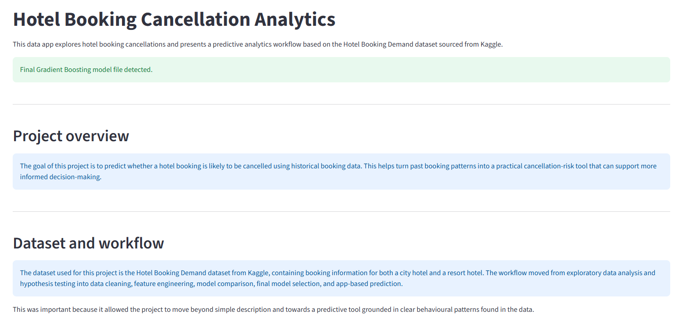 | 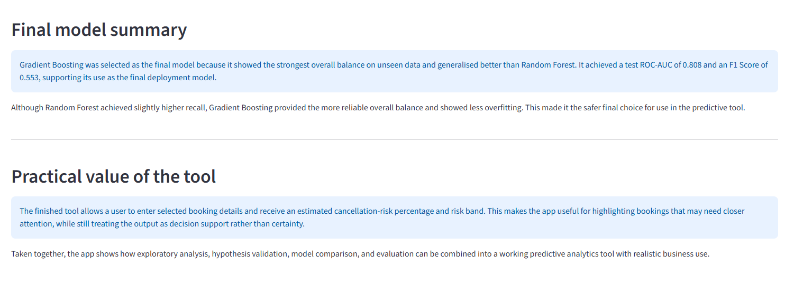 |

### Project Hypotheses and Validation

The **Project Hypotheses and Validation** page brings together the main
hypotheses used during the exploratory stage of the analysis and shows
how each one was checked against the hotel booking data.

This page helps explain why the final predictive tool uses the features
it does. Rather than selecting inputs at random, the page shows that the
final workflow was grounded in patterns that were first explored and
validated through analysis.

The page covers four main hypotheses:

- longer lead times are linked with higher cancellation risk
- deposit type is linked with cancellation behaviour
- previous cancellation history increases future cancellation risk
- repeated guests are less likely to cancel than non-repeated guests

| Project Hypotheses and Validation - page introduction |
|---|
| 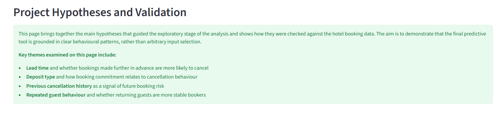 |

#### H1: Longer lead times are associated with higher cancellation risk

This section explains the first hypothesis and shows that bookings made
further in advance were more likely to be cancelled. The written content
summarises how the hypothesis was examined, gives the verdict, and
explains why the finding matters in the context of the final predictive
tool.

| H1 content | H1 supporting chart |
|---|---|
| 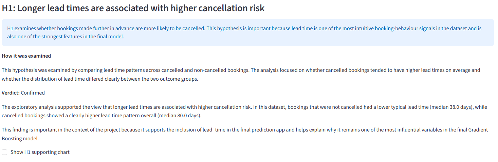 | 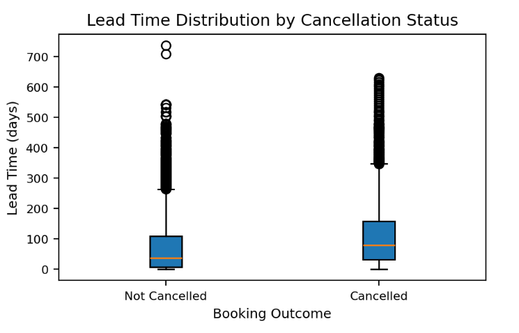 |

#### H2: Deposit type is strongly linked to cancellation behaviour

This section shows that deposit type was a meaningful booking-risk
signal in the dataset. The page explains the reasoning behind the
hypothesis, gives the result, and supports it with a chart comparing
cancellation rates across deposit categories.

| H2 content | H2 supporting chart |
|---|---|
| 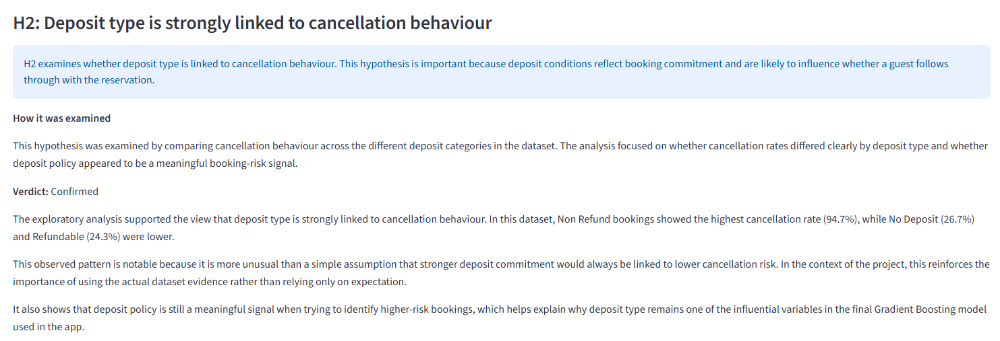 | 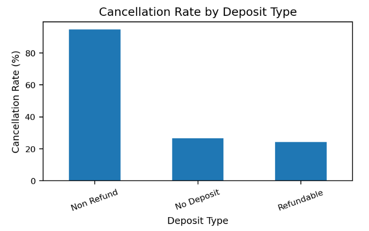 |

#### H3: Previous cancellation history increases future cancellation risk

This section shows that guests with previous cancellations were more
likely to cancel again. It supports the idea that customer-history
features can provide useful predictive value, not just details from the
current booking.

| H3 content | H3 supporting chart |
|---|---|
| 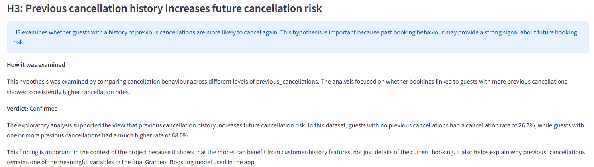 | 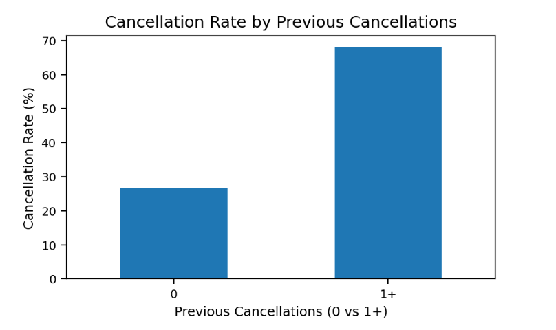 |

#### H4: Repeated guests are less likely to cancel than non-repeated guests

This section shows that repeated guests had a lower cancellation rate
than non-repeated guests. This helps demonstrate that customer loyalty
and previous booking behaviour can act as useful signals when assessing
cancellation risk.

| H4 content | H4 supporting chart |
|---|---|
| 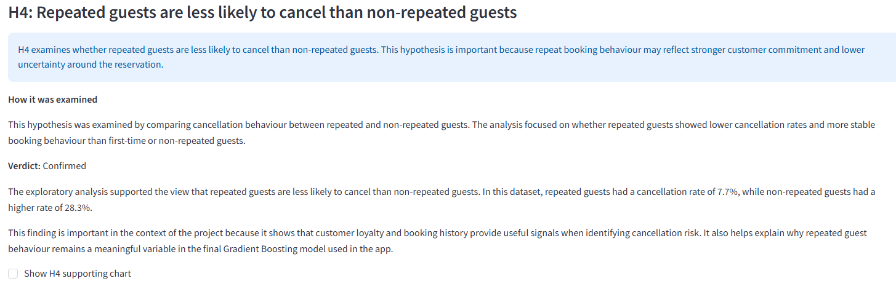 | 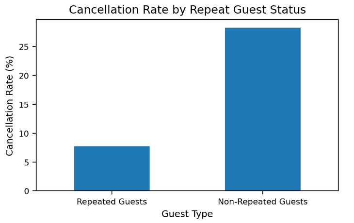 |

### EDA Insights

The **EDA Insights** page showcases the main patterns found during the
exploratory analysis stage and shows which booking features were most
closely linked to cancellation behaviour before modelling began.

This was important because it helped move the tool towards a more
evidence-based prediction workflow. By identifying which booking
features showed the clearest differences in cancellation behaviour, the
exploratory analysis supported later hypothesis validation, feature
selection, and final model development.

The EDA Insights page combines written explanations with supporting
charts so that the findings are clear and easy to follow.

The image below shows the opening section of the EDA Insights page. This
introductory section gives the user a clear overview of the main findings
presented on the page and helps explain the purpose and structure of the
section.

| EDA Insights - page introduction |
|---|
| 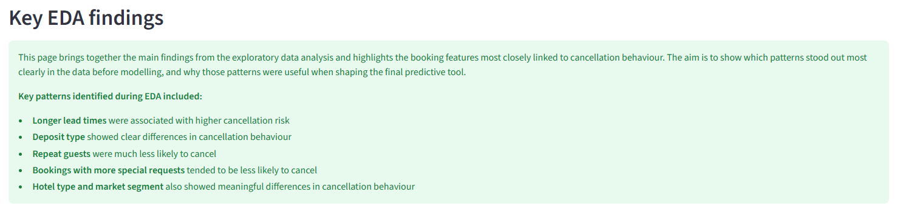 |

The strongest patterns identified during EDA were longer lead times,
clear deposit-type differences, lower cancellation rates among repeated
guests, and meaningful variation across market segments.

#### Lead time and cancellation

One of the clearest early patterns in the data was that bookings made
further in advance were more likely to be cancelled. Cancelled bookings
showed a noticeably higher average lead time than non-cancelled
bookings, suggesting that longer planning horizons may create more time
for plans to change.

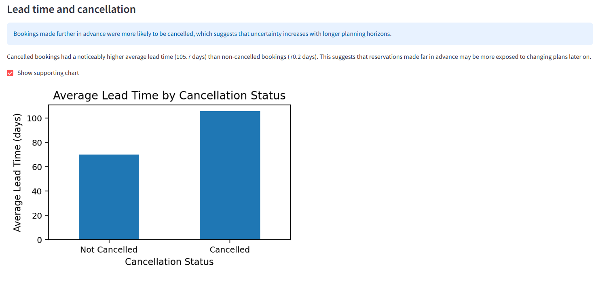

#### Deposit type and cancellation

Deposit type also showed one of the strongest relationships with
cancellation behaviour. In particular, non-refundable bookings had a far
higher cancellation rate than the other deposit categories, making
deposit type an important feature to examine before modelling.

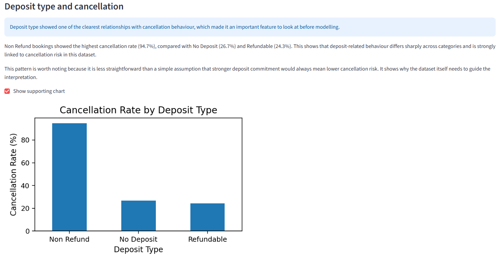

#### Repeat guests and cancellation

Repeat guests were much less likely to cancel than non-repeat guests.
This suggested that previous customer history and booking loyalty could
act as useful behavioural signals when assessing cancellation risk.

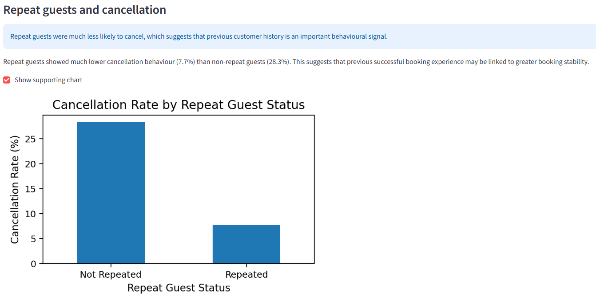

#### Market segment and cancellation

Cancellation behaviour also varied across market segments. While some
categories needed cautious interpretation because of small sample size,
the page still showed that booking channel and customer context could
add useful information for prediction.

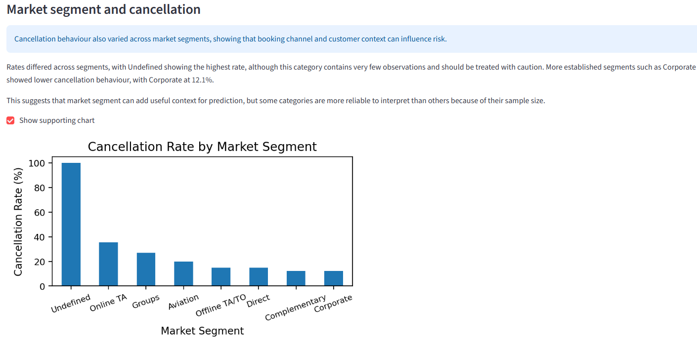

The EDA page helped show that cancellation behaviour was not random. It
highlighted clear behavioural and booking-related patterns in the
dataset, which later supported the hypothesis testing stage and helped
justify the final predictive workflow.

### Model Comparison

The **Model Comparison** page explains how the classification models
tested were compared and why **Gradient Boosting** was
selected as the final deployed model.

This was important because the final predictive tool needed more
than a single strong metric. We had to consider overall
performance on unseen data, the balance between precision and recall,
and whether a model generalised well rather than overfitting.

This page combines a summary, comparison visuals, and final model
metrics so that the user can clearly see why the final model was chosen.

The image below shows the opening section of the Model Comparison page.
This introduction explains the purpose of the page and gives the user a
clear overview of the main comparison sections that follow.

| Model Comparison - page introduction |
|---|
| 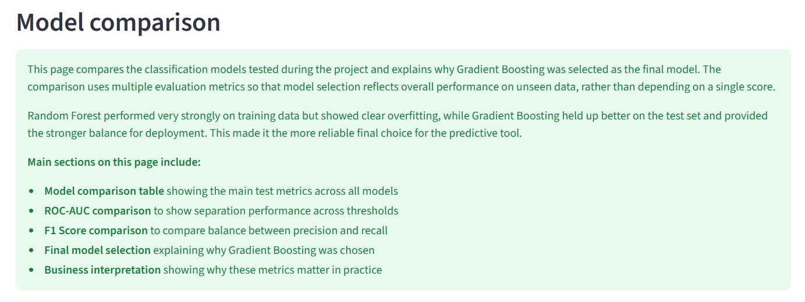 |

The page brings together the main model comparison evidence, including
the comparison table, ROC-AUC scores, F1 Score comparison, and the final
selected model metrics.

#### Model comparison table

The comparison table gives a clear summary of the main test set metrics
across all models. This helps the user compare each model side by side
rather than relying on a single chart or score in isolation.

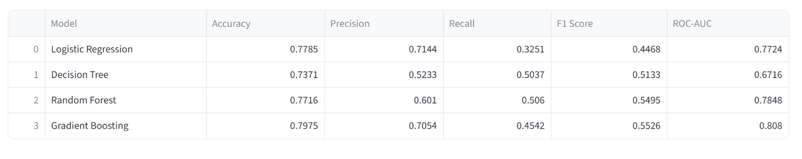

#### ROC-AUC comparison across models

The ROC-AUC chart shows how well each model separates cancelled and
non-cancelled bookings across different thresholds. This matters because
the predictive tool returns a risk probability, so good ranking and
separation performance are important.

Gradient Boosting achieved the highest ROC-AUC, showing the strongest
overall separation performance on unseen data.

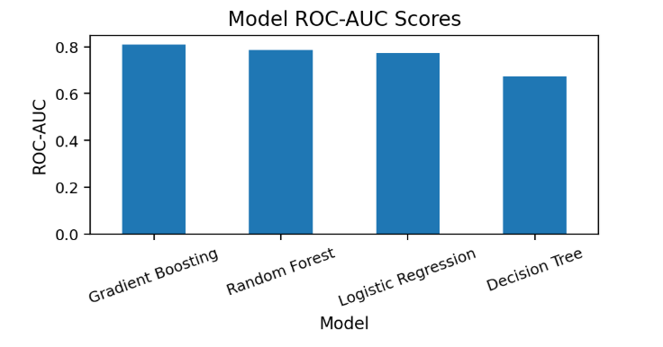

#### F1 Score comparison across models

The F1 Score comparison is very useful because it balances precision and
recall. This makes it a strong measure when cancellation prediction
involves a trade off between catching risky bookings and avoiding too
many false alerts.

Gradient Boosting also achieved the strongest F1 Score, which supported
its stronger overall balance compared with the other tested models.

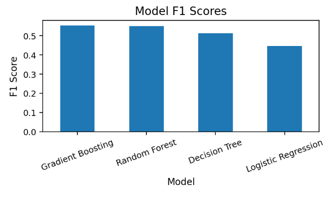

#### Final model selection

The final model selection section summarises why Gradient Boosting was
chosen for deployment. Although Random Forest achieved slightly higher
recall, Gradient Boosting provided the better overall balance and showed
more stable performance on unseen data.

This made it the safer and more reliable choice for the final predictive
tool.

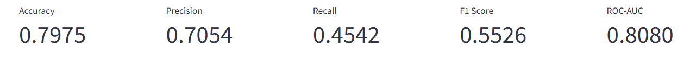

The Model Comparison page helped show that the final model choice was
not arbitrary. It provided clear evidence that Gradient Boosting offered
the strongest balance for deployment, which supported the reliability
of the finished predictive tool.

## Agile Methodology
The GitHub Projects board used to plan and track development can be
viewed [here](https://github.com/users/moranjohn-95/projects/11).

This predictive analyitcs project was planned and tracked using GitHub Projects
boards. The board was used to organise the work into epics and user
stories so that development could be broken into smaller and more manageable
steps.

The workflow was structured using the below columns:

- **Epics**
- **Todo**
- **In Progress**
- **Testing / In Review**
- **Done**

This helped track the work from early planning through development,
testing, and completion.

### Epics and User Stories

The board was built around six main epics:

- Project Planning & Business Understanding
- Exploratory Data Analysis & Hypothesis Validation
- Data Cleaning & Feature Engineering
- Model Training, Comparison & Final Selection
- Dashboard & Prediction Tool Development
- Testing, Deployment & Documentation

Each epic was then broken down into smaller user stories linked to the
main parts of the tool, such as dataset selection, exploratory
analysis, hypothesis validation, model comparison, prediction, and final
deployment.

All user stories for this tool were labelled as **must-have** because
they were directly linked to the predictive analytics workflow and
the final deployed dashboard.

### Agile Board Progression

The images below show how the board was used during development and how
the work moved through the different stages over time from the left (in progress) to the right (final state).

| In-progress board view | Final board state |
|---|---|
| 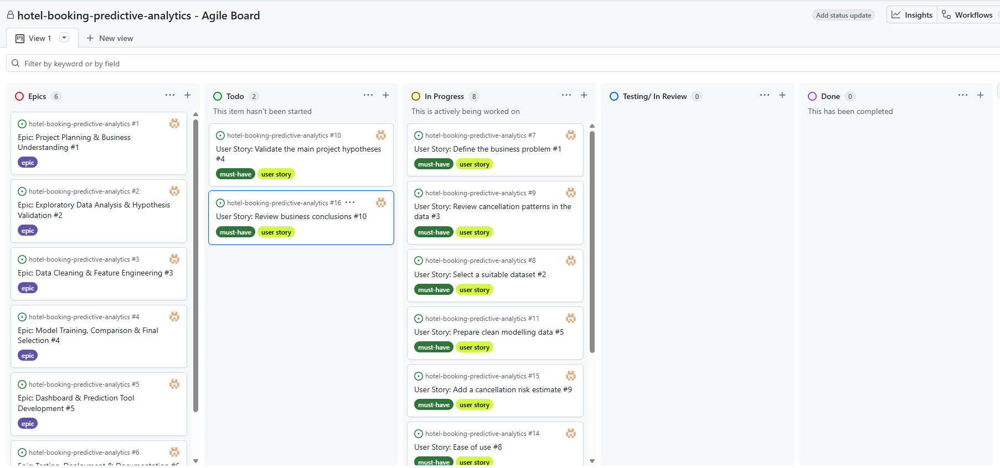 | 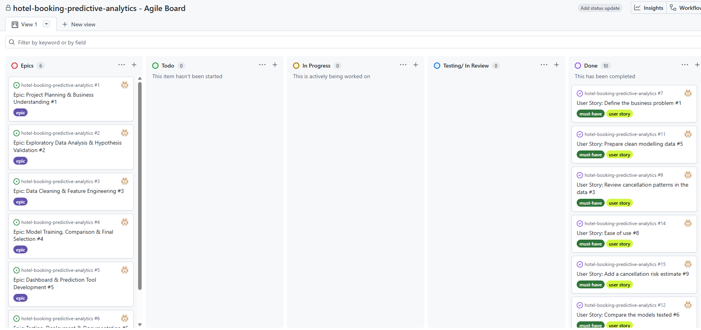 |

### How the Board Was Used

The board was updated throughout development as work progressed across
the project. Items were moved between columns to reflect their current
status, helping to show what had been planned, what was being worked on,
what was under review, and what had been completed.

This approach helped keep the workflow clear and supported a more
structured development process, rather than building the tool in an
unplanned way.

### Why This Was Useful

Using an agile board proved to be useful because it made the development process
easier to manage and review. It helped break the work into clear stages,
kept the main priorities visible and supported steady progress across
the full workflow.

It also provided a clear record of how the tool moved from planning and
analysis into modelling, dashboard development, testing, deployment, and
documentation.

## Testing

The below section discusses the testing carried out during and after the
development of the hotel booking predictive analytics tool.

### Python Code Validation (CI Python Linter)

The custom Python code used in the deployed application was tested using
the **Code Institute Python Linter (PEP8CI)** to confirm that the main
application file is readable, maintainable, and free from syntax or
formatting errors.

The purpose of this testing was to confirm that:

- Python code follows PEP8 styling conventions.
- there are no syntax or indentation errors.
- the deployed application file meets Code Institute assessment
  expectations.

For this project, **app.py** was the only custom tracked Python source
file used in the deployed predictive tool. Notebook files were not
included in this part of testing because they are not part of the live
application file structure in the same way.

All tested files returned **All clear, no errors found**.

#### Python Files Tested

| App / Area | File | Validator Confirmation | Result |
|---|---|---|---|
| Streamlit Dashboard | `app.py` | CI Python Linter | No errors |

#### Evidence

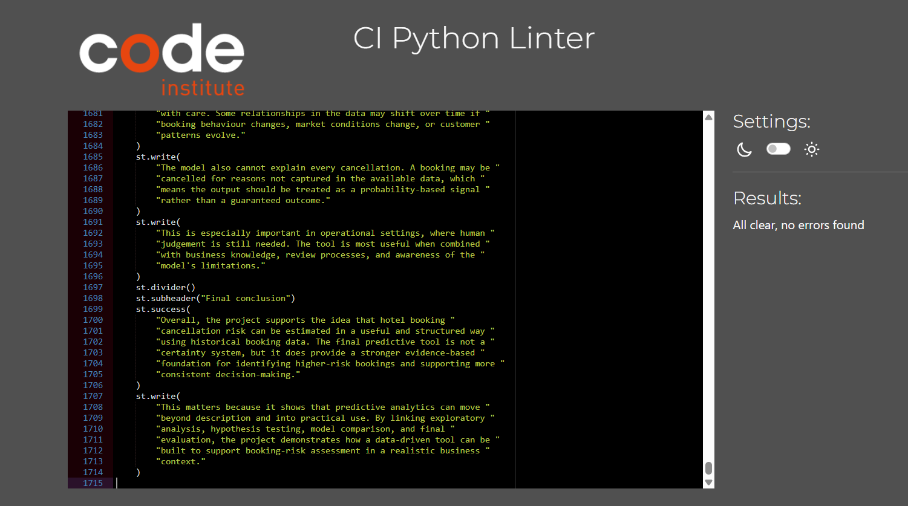

#### Python Testing Summary

- `app.py` passed the Code Institute Python Linter.
- no PEP8 errors or warnings were reported.
- the deployed dashboard file is readable and properly formatted.

---

### Manual Testing

Manual testing was carried out throughout development to confirm that
the dashboard behaved as expected and that the main features worked
correctly in both local development and the deployed version.

Testing focused on:

- page navigation
- chart visibility
- content layout
- model comparison content
- prediction tool behaviour
- risk output and risk band display
- model performance evidence
- business conclusions and limitations
- live deployment checks

All manually tested features behaved as intended, with no critical
issues found in the final deployed version.

#### Manual Testing Summary Table

| Feature Area | Test Action | Expected Result | Outcome |
|---|---|---|---|
| Sidebar Navigation | Click each page in the sidebar | Correct page loads without error | Pass |
| Quick Project Summary | Open the summary page | Tool purpose, dataset, workflow, and final model summary are shown correctly | Pass |
| Project Hypotheses and Validation | Open the hypotheses page | Each hypothesis is displayed with verdict, interpretation, and supporting chart option | Pass |
| EDA Insights | Open the EDA page and expand chart sections | Key findings and related charts display correctly | Pass |
| Model Comparison | Open the model comparison page | Comparison table and model evaluation summaries are shown clearly | Pass |
| Model Comparison | Review final model section | Gradient Boosting is shown as the final selected model | Pass |
| Prediction Tool | Enter valid booking inputs and run prediction | A cancellation-risk percentage and risk band are returned | Pass |
| Prediction Tool | Change booking inputs and run prediction again | The output updates correctly based on the selected inputs | Pass |
| Prediction Tool | Review selected booking profile section | Input summary matches the selected values used in the prediction | Pass |
| Model Performance | Open the model performance page | Metrics, feature importance, confusion matrix, and diagnostic sections load correctly | Pass |
| Model Performance | Expand classification report | Classification report appears correctly and matches the final model output | Pass |
| Business Conclusions | Open the business conclusions page | Practical use, limitations, and final conclusion are shown clearly | Pass |
| Live Deployment | Open the Heroku app | The deployed dashboard loads successfully online | Pass |
| Live Deployment | Test multiple pages on the live app | Pages load and function correctly in deployment | Pass |

#### Manual Testing Conclusion

Manual testing confirmed that:

- all main dashboard pages load correctly
- the prediction tool returns a valid output
- content and interpretation match the final deployed model
- the deployed app is stable and usable

---

### Prediction Tool and Model Validation

Additional checks were carried out to make sure the dashboard remained
properly aligned with the final deployed model.

This was important because the predictive tool was updated during
development to ensure that the live app only used realistic and
actual deployed input features.

The following checks were completed:

- the final deployed model used in the app is **Gradient Boosting**.
- the app inputs match the final deployed feature set.
- prediction output is based on the cancellation class probability.
- the displayed risk band matches the returned prediction score.
- final metrics shown in the dashboard match the selected final model.
- model interpretation text reflects the final workflow and results.

These checks confirmed that the dashboard was not only functional, 
but also technically aligned with the final model used in deployment.

---

### User Story Testing

User stories were also tested to confirm that all acceptance criteria were met. 
The table below summarises each user stories used for this application
and the evidence supporting each one.

| User Story | Result | Evidence |
|---|---|---|
| **As the software engineer, I want to define the cancellation-risk problem. So that the predictive tool is built around a clear business need.** | Pass | Quick Project Summary page / README Project Overview |
| **As the software engineer, I want to select a suitable dataset. So that the predictive tool can be built on relevant historical booking data.** | Pass | Quick Project Summary page / README Dataset Content |
| **As a user, I want to review cancellation patterns in the data. So that I can understand the main behavioural signals before modelling.** | Pass | EDA Insights page |
| **As a user, I want to validate the main project hypotheses. So that I can see whether the key assumptions were supported by the data.** | Pass | Project Hypotheses and Validation page |
| **As the software engineer, I want to prepare clean modelling data. So that the final predictive tool uses realistic and reliable inputs.** | Pass | Model Performance page / README workflow sections |
| **As a user, I want to compare the models tested. So that I can understand how the final model was selected.** | Pass | Model Comparison page |
| **As a user, I want the deployed model to be the one that gives the best overall balance on unseen data. So that the predictive tool is reliable in practice.** | Pass | Quick Project Summary / Model Comparison / deployed app |
| **As a user, I want the dashboard to be easy to use. So that I can move through the tool clearly and understand the outputs.** | Pass | Full deployed dashboard |
| **As a user, I want to add booking details and receive a cancellation-risk estimate. So that I can assess booking risk in a practical way.** | Pass | Prediction Tool page |
| **As a user, I want to review business conclusions. So that I can understand the practical use and limitations of the tool.** | Pass | Business Conclusions page |

User story testing confirmed that the planned features were
implemented and worked as expected in the final predictive tool.

---

### Deployment Testing

After deployment to Heroku, the live version of the application was
tested to confirm that the dashboard worked correctly outside the local
development environment.

The deployed application was checked for the following:

- successful app loading.
- correct sidebar navigation.
- working page content across the dashboard.
- successful loading of the final model file.
- successful prediction output from the live prediction tool.

Testing after deployment confirmed that the live application behaved as
expected and that the final dashboard was accessible and functional in
its deployed environment.

---

### Testing Conclusion

Testing showed that the final predictive analytics dashboard is stable,
consistent, and aligned with the final deployed model.
