# hotel-booking-predictive-analytics
A machine learning powered web application for exploring hotel booking
cancellation patterns and predicting cancellation risk using historical
hotel booking data.

## Table of Contents
1. [Project Overview](#project-overview)
2. [Dataset Content](#dataset-content)
3. [Business Requirements](#business-requirements)
4. [Hypotheses and Validation](#hypotheses-and-validation)
5. [Rationale to Map Business Requirements to Data Visualisations and ML Tasks](#rationale-to-map-business-requirements-to-data-visualisations-and-ml-tasks)
6. [ML Business Case](#ml-business-case)
7. [Dashboard Design](#dashboard-design)
8. [Features](#features)
9. [Technologies Used](#technologies-used)
10. [Agile Methodology](#agile-methodology)
11. [Testing](#testing)
12. [Bugs](#bugs)
13. [Deployment](#deployment)
14. [Credits](#credits)
15. [Acknowledgements](#acknowledgements)

## Project Overview

### Purpose

This predictive tool is focused on hotel booking cancellation risk. It
uses historical booking data from the Hotel Booking Demand dataset to
explore which booking patterns are most closely linked to cancellations
and to estimate the likelihood of a booking being cancelled.

The application was built in Streamlit and turns exploratory analysis,
hypothesis testing, model comparison, and final evaluation into a
practical prediction tool. The aim is not to predict cancellation with
certainty, but to provide a structured, evidence-based estimate that can
support booking-risk assessment and decision-making.

### Target Audience

This predictive tool is useful for:

- hotel managers who want better visibility of cancellation risk.
- revenue or operations teams reviewing booking behaviour.
- analysts interested in identifying patterns linked to cancellations.
- businesses exploring how predictive analytics can support booking-risk
  decisions.

### Value Proposition

The value of this predictive tool is that it shows how historical
booking data can be used to move beyond simple reporting and towards
practical risk prediction.

This predictive tool helps to:

- identify booking features linked to higher or lower cancellation risk.
- compare machine learning models in a structured way.
- provide an estimated cancellation-risk score for selected booking
  profiles.
- support more consistent review of bookings that may need closer
  attention.

Overall, the tool demonstrates how predictive analytics can be used to
build a realistic decision support application in a hotel booking
context.

## Dataset Content

The data used for this predictive tool comes from the **Hotel Booking
Demand** dataset, sourced from **Kaggle**.

This dataset contains hotel booking information for two hotel types:

- **City Hotel**
- **Resort Hotel**

It includes historical booking records with details related to booking
timing, customer behaviour, reservation characteristics, and
cancellation outcomes.

### Dataset Summary

- **Dataset name:** Hotel Booking Demand
- **Source:** Kaggle
- **Target variable:** `is_canceled`
- **Prediction type:** Binary classification
- **Outcome classes:**
  - `0` = booking not cancelled
  - `1` = booking cancelled

### Content of the Dataset

The dataset includes a mix of numeric and categorical booking features.
Examples include:

- lead time
- average daily rate (ADR)
- total special requests
- previous cancellations
- previous bookings not cancelled
- repeated guest status
- hotel type
- deposit type
- customer type
- meal plan
- market segment

These features were useful because they describe both the booking itself
and aspects of customer behaviour, which made them suitable for
exploring cancellation risk.

### Why This Dataset Was Suitable

This dataset was suitable for the predictive tool because it contains a
clear cancellation outcome and a wide range of booking related features
that can be analysed before modelling.

It also includes both **City Hotel** and **Resort Hotel** bookings,
which helps provide a broader view of cancellation behaviour across
different hotel contexts.

### Target for the Predictive Tool

The predictive tool was built to estimate whether a booking is likely to
be cancelled. For that reason, the target used throughout the workflow
was:

- `is_canceled`

This made the task a supervised machine learning classification problem,
where the tool learns from past booking outcomes and applies those
patterns to new booking inputs.

### Dataset Considerations

Although the dataset was strong for this type of predictive task, it
still has some limitations.

Some booking fields were not suitable for deployment because they could
introduce leakage or would not be realistically available as app inputs
at prediction time. These fields were removed from the final
deployed workflow so that the predictive tool would stay
realistic and properly match up.

## Business Requirements

The main aim of this predictive tool is to support better understanding
and assessment of hotel booking cancellation risk using historical
booking data.

The business requirements for the tool were defined around 3 main
needs.

### BR1: Understand the booking patterns linked to cancellations

A hotel business needs to understand which booking features are better indicators
and more linked to cancellation behaviour.

This includes identifying patterns such as:

- if longer lead times are linked to higher cancellation risk.
- if deposit type influences cancellation behaviour.
- if repeated guests are less likely to cancel.
- if previous cancellation history affects future risk.
- if hotel type, market segment, and special requests show useful
  behavioural differences.

This requirement was important because a good predictive tool should
not begin with modelling alone. It first needs to show that meaningful
patterns exist in the data.

### BR2: Predict the likelihood of a booking being cancelled

A hotel business needs a tool that can take selected booking inputs and
return an estimated cancellation risk.

This requirement was addressed by building a supervised machine learning
classification workflow that uses historical booking patterns to produce:

- a cancellation risk percentage.
- a risk band.
- a transparent summary of the selected booking profile.

This requirement was important because the aim was not only to analyse
past cancellations, but also to turn that analysis into a working
predictive tool.

### BR3: Support more informed booking-risk decisions

A hotel business needs a practical way to use model output to support
decision making, while recognising that predictions are not certainty.

This means the tool should help users:

- identify bookings that may need closer review.
- interpret the output in a practical way.
- understand the limits of the prediction.
- use the result as decision support rather than as a guaranteed answer.

This requirement was important because the value of the tool depends on
whether the output can be used in a realistic business context.

### How the Predicitve Tool Addresses These Requirements

The finished predictive tool addresses these business requirements by combining:

- exploratory data analysis to identify important patterns.
- hypothesis validation to test key assumptions.
- model comparison to select the strongest final model.
- a prediction interface that returns an estimated cancellation risk.
- evaluation and business conclusions to explain how the output should
  be used in practice.

These requirements helped shape the full workflow and
kept the predicitve tool focused on practical booking risk assessment rather than
prediction for its own sake.

## Hypotheses and Validation

The hypotheses for this predictive tool were based on booking and
behavioural patterns that were expected to influence cancellation risk.
These were then checked against the dataset through exploratory
analysis and grouped comparisons before moving into final model
selection.

### Hypothesis Summary

| Hypothesis | Verdict | Key evidence |
|---|---|---|
| **H1:** Longer lead times are associated with higher cancellation risk | Confirmed | Median lead time was **38.0 days** for non cancelled bookings and **80.0 days** for cancelled bookings |
| **H2:** Deposit type is strongly linked to cancellation behaviour | Confirmed | `Non Refund` had the highest cancellation rate at **94.7%**, compared with `No Deposit` at **26.7%** and `Refundable` at **24.3%** |
| **H3:** Previous cancellation history increases future cancellation risk | Confirmed | Guests with no previous cancellations had a cancellation rate of **26.7%**, compared with **68.0%** for guests with one or more previous cancellations |
| **H4:** Repeated guests are less likely to cancel than non repeated guests | Confirmed | Repeated guests had a cancellation rate of **7.7%**, compared with **28.3%** for non repeated guests |

### H1: Longer lead times are associated with higher cancellation risk  

**How it was examined**  
This was examined by comparing lead time patterns across cancelled and
non-cancelled bookings. The analysis focused on whether cancelled
bookings showed higher lead times overall and whether the difference was
clear enough to support inclusion of `lead_time` in the final workflow.

**Verdict**  
Confirmed.

**What the data showed**  
Bookings that were not cancelled had a lower typical lead time
(**median 38.0 days**), while cancelled bookings showed a clearly higher
lead time pattern overall (**median 80.0 days**).

**Interpretation**  
This supported the view that longer lead times are linked to higher
cancellation risk. This makes practical sense because bookings made well
in advance leave more time for plans to change. It also helped justify
why `lead_time` remained one of the most important variables in the
final predictive tool.

### H2: Deposit type is strongly linked to cancellation behaviour.

**How it was examined**  
This was examined by comparing cancellation rates across the deposit
categories in the dataset. The analysis looked at whether cancellation
rates differed clearly by deposit type and whether deposit policy
appeared to be a useful booking-risk signal.

**Verdict**  
Confirmed.

**What the data showed**  
`Non Refund` bookings showed the highest cancellation rate
(**94.7%**), while `No Deposit` (**26.7%**) and `Refundable`
(**24.3%**) were much lower.

**Interpretation**  
This was one of the clearest findings in the dataset, although the
pattern was less straightforward than a simple assumption that stronger
deposit commitment would always lead to lower cancellation risk. This
reinforced the importance of relying on the data itself rather than on
expectation alone. It also helped explain why `deposit_type` remained a
strong feature in the final predictive tool.

### H3: Previous cancellation history increases future cancellation risk

**How it was examined**  
This was examined by comparing cancellation behaviour across different
levels of `previous_cancellations`. The analysis focused on whether
guests with one or more previous cancellations showed consistently
higher cancellation rates than those with none.

**Verdict**  
Confirmed.

**What the data showed**  
Guests with no previous cancellations had a cancellation rate of
**26.7%**, while guests with one or more previous cancellations had a
much higher rate of **68.0%**.

**Interpretation**  
This showed that past customer behaviour can provide a strong signal
about future booking risk. It also supported the inclusion of
`previous_cancellations` in the final workflow and helped show that the
tool benefits not only from current booking details, but also from
customer history.

### H4: Repeated guests are less likely to cancel than non-repeated guests

**How it was examined**  
This was examined by comparing cancellation behaviour between repeated
and non-repeated guests. The analysis focused on whether repeated guests
showed lower cancellation rates and more stable booking behaviour.

**Verdict**  
Confirmed.

**What the data showed**  
Repeated guests had a cancellation rate of **7.7%**, while
non-repeated guests had a higher rate of **28.3%**.

**Interpretation**  
This suggested that customer loyalty and prior successful booking
history are useful signals when identifying cancellation risk. It also
helped justify why repeated guest behaviour remained part of the final
predictive tool.

### Overall Conclusion

The hypothesis testing stage showed that cancellation
risk was strongly influenced by a small group of booking related and
behavioural features.

Longer lead times, deposit type, previous cancellation history, and
repeated guest behaviour all showed meaningful relationships with
cancellation outcomes. These findings helped support the final feature
set and showed that the predictive tool was grounded in clear patterns
from the data.

## Rationale to Map Business Requirements to Data Visualisations and ML Tasks

This section explains how the main business requirements were linked to
the analysis, visualisations, and machine learning tasks used in the
predictive tool.

The aim was to make sure that the app did not just include charts and
models for presentation purposes. Each visual and modelling step was
included because it helped answer a clear business need related to hotel
booking cancellation risk.

### BR1: Understand the booking patterns linked to cancellations

This requirement focused on identifying which booking and customer
features were most closely linked with cancellation behaviour.

#### Data visualisations used for BR1

- lead time comparison between canceled and non cancelled bookings.
- deposit type cancellation comparison.
- repeat guest vs non repeat guest cancellation comparison.
- special requests comparison.
- hotel type comparison.
- market segment comparison.

These visualisations were useful because they helped show where the
clearest behavioural differences appeared in the data before modelling.

#### Why these visuals mattered

The exploratory visuals made it easier to see that cancellation risk was
definetley not random. They showed that some features such as lead time, deposit
type, previous cancellation history, and repeated guest behaviour, had
clear relationships with the outcome.

This was important because it helped justify which features were worth
carrying forward into the predictive workflow.

### BR2: Predict the likelihood of a booking being cancelled

This requirement focused on building a tool that could estimate
cancellation risk from selected booking inputs.

#### ML task used for BR2

- supervised machine learning
- binary classification
- target variable: `is_canceled`
- output: cancellation risk probability and risk band

This task was appropriate because the tool needed to predict one of two
possible outcomes:

- booking not cancelled
- booking cancelled

#### Why this ML task mattered

A binary classification approach allowed the tool to learn from
historical booking outcomes and apply those patterns to new booking
profiles.

This made it possible to return:

- an estimated cancellation-risk percentage
- a risk band
- a practical booking-risk output that could support review and planning

### BR3: Support more informed booking-risk decisions

This requirement focused on making sure the model output could be used
in a realistic business context rather than as a technical result only.

#### Evaluation and interpretation methods used for BR3

- model comparison across multiple algorithms.
- train/test evaluation.
- confusion matrix.
- classification report.
- ROC-AUC and F1 comparison.
- business interpretation of model outputs.
- limitations and conclusion sections.

These were useful because they helped explain not only
how the final model performed, but also what that performance meant in
practice.

#### Why this mattered

A useful cancellation risk tool must do more than produce a prediction.
It must also show:

- why the final model was selected.
- how reliable it is on unseen data.
- what trade offs exist between missed cancellations and false alerts.
- why the output should be used as decision support rather than
  certainty.

This helped keep everything aligned with the business requirement of
supporting more informed booking risk decisions.

### Overall Rationale

The visualisations and ML tasks were chosen to answer
clear business questions.

The exploratory analysis helped identify the booking patterns linked to
cancellations, the classification workflow turned those patterns into a
predictive model, and the evaluation sections showed why the final tool
was suitable for practical use. This created a clear link between the
business requirements, the data analysis, and the final predictive tool.

## ML Business Case

The machine learning task used in this tool is **supervised learning**
with **binary classification**.

The aim of the model is to estimate whether a hotel booking is more
likely to be cancelled or not cancelled, based on historical booking
data and selected booking features.

### Business Case Summary

| Element | Detail |
|---|---|
| **Aim** | Estimate the likelihood of a booking being cancelled using historical booking data |
| **ML method** | Supervised learning - binary classification |
| **Target variable** | `is_canceled` |
| **Output** | Cancellation risk probability and risk band |
| **Final model** | Gradient Boosting |
| **Use case** | Support booking risk review and more informed decision making |
| **Primary focus** | Balanced performance on unseen data rather than one metric alone |

### Why a Classification Model Was Suitable

This tool needed to predict one of two possible outcomes:

- booking not cancelled
- booking cancelled

That made binary classification the correct machine learning approach.

A classification model was suitable because the dataset already included
a labelled target `is_canceled`, which allowed the model to learn from
past outcomes and apply those patterns to new booking details.

### Why Probability Output Was Important

The aim of the tool was not just to return a yes or no prediction. It
also needed to provide an **estimated cancellation risk percentage** so
that the result could be interpreted more usefully.

This mattered because booking risk assessment is not always best handled
as a simple binary decision. A probability based output allows the predictive tool
to:

- show whether the risk looks low, medium, or high.
- support review of bookings that may need closer attention.
- help users interpret the strength of the model output more clearly.

### Expected Business Value

The expected value of the predictive tool is that it can help identify
bookings that may be more likely to cancel before arrival.

In a practical hotel setting, this could support actions such as:

- reviewing higher risk bookings more closely.
- applying reminder messages or follow up actions.
- informing deposit or booking policy decisions.
- supporting more consistent booking risk assessment.

The tool is not designed to replace judgement. Its role is to provide a
structured and evidence based signal that may support better decision making.

### Success Criteria

The final model needed to show that it could generalise well on unseen
data and provide a useful balance across the main evaluation metrics.

For this reason, model selection was based on:

- ROC-AUC
- Precision
- Recall
- F1 Score
- train/test stability

The chosen model needed to be balanced and reliable enough for 
deployment.

### Final Model Choice in the Business Case

Gradient Boosting was selected as the final model because it provided
the strongest overall balance on unseen data and generalised better than
Random Forest.

It achieved a test **ROC-AUC of 0.808** and an **F1 Score of 0.553**,
while also showing a much smaller train test gap than Random Forest.
Although Random Forest achieved slightly higher recall, Gradient
Boosting was the more reliable overall choice for deployment.

### Business Case Conclusion

This machine learning business case supports the use of a classification
model to estimate cancellation risk in a realistic booking context.

The final predictive tool shows that historical booking behaviour can be used to
produce a practical and probability based output, giving users a clearer way
to assess risk and support booking related decisions.

## Dashboard Design

### Dashboard Structure

The dashboard was designed to guide the user through the full predictive
analytics workflow in a clear order, starting with a quick project summary
and moving through evidence, modelling, prediction, evaluation, and
final business interpretations.

The page order was structured as follows:

| Dashboard Page | Purpose |
|---|---|
| **Quick Project Summary** | Introduces the tool, dataset, workflow, final model, and practical purpose |
| **Project Hypotheses and Validation** | Tests the main assumptions about cancellation behaviour before modelling |
| **EDA Insights** | Highlights the key patterns found in the data |
| **Model Comparison** | Compares the models tested and explains why Gradient Boosting was selected |
| **Prediction Tool** | Allows the user to enter booking details and see an estimated cancellation risk result |
| **Model Performance** | Explains how the final model was evaluated using metrics, feature importance, confusion matrix, and diagnostic plots |
| **Business Conclusions** | Translates the results into practical business meaning and limitations |

### Design Approach

The dashboard was designed to be easy to navigate and follow.
The aim was to make the analytical process understandable without
removing the technical depth of the tool.

A consistent page structure was used throughout the app, including:

- clear page headings.
- coloured information boxes for summaries, explanations, and warnings.
- divider lines between major sections.
- short interpretation text alongside charts and metrics.
- a sidebar navigation menu.

This helped keep the dashboard readable and made it easier to move from
one stage of the workflow to the next.

### Why This Design Was Suitable

This layout was suitable because the predictive tool is not only meant to show a
prediction. It also needs to explain how that prediction was reached,
what patterns were found in the data, why the final model was chosen,
and how the resutl should be used in practice.

The final design supports the overall project purpose of by combining:

- exploratory analysis
- hypothesis validation
- model comparison
- practical prediction
- model evaluation
- business interpretation

This gives the dashboard a clear analytical flow and helps make the
predictive tool more transparent.

### User Experience Considerations

The dashboard was designed so that users can either move through the
pages in order or jump directly to a section of interest using the
sidebar.

This makes the application useful for different types of users. Some may want a
quick overview and prediction result, while others may want to review
the full analytical process behind the model.

The layout also supports interpretability by ensuring that outputs are
explained and that risk estimates are presented as
decision support not certainty.

## Features 

### Quick Project Summary

The **Quick Project Summary** page acts as the landing page for the
dashboard and gives the user an immediate overview of the predictive
tool.

It introduces the purpose of the application, names the dataset used,
summarises the analytical workflow, confirms the final deployed model,
and explains the practical value of the tool in simple terms. This page
was designed to help users understand what the dashboard does before
moving into the more detailed analytical sections.

The page also makes it clear that the final deployed model is
**Gradient Boosting**, and that the tool is intended to support
cancellation-risk assessment rather than provide certainty.

| Quick Project Summary - overview | Quick Project Summary - final model and practical value |
|---|---|
|  |  |

### Project Hypotheses and Validation

The **Project Hypotheses and Validation** page brings together the main
hypotheses used during the exploratory stage of the analysis and shows
how each one was checked against the hotel booking data.

This page helps explain why the final predictive tool uses the features
it does. Rather than selecting inputs at random, the page shows that the
final workflow was grounded in patterns that were first explored and
validated through analysis.

The page covers four main hypotheses:

- longer lead times are linked with higher cancellation risk
- deposit type is linked with cancellation behaviour
- previous cancellation history increases future cancellation risk
- repeated guests are less likely to cancel than non-repeated guests

| Project Hypotheses and Validation - page introduction |
|---|
|  |

#### H1: Longer lead times are associated with higher cancellation risk

This section explains the first hypothesis and shows that bookings made
further in advance were more likely to be cancelled. The written content
summarises how the hypothesis was examined, gives the verdict, and
explains why the finding matters in the context of the final predictive
tool.

| H1 content | H1 supporting chart |
|---|---|
|  |  |

#### H2: Deposit type is strongly linked to cancellation behaviour

This section shows that deposit type was a meaningful booking-risk
signal in the dataset. The page explains the reasoning behind the
hypothesis, gives the result, and supports it with a chart comparing
cancellation rates across deposit categories.

| H2 content | H2 supporting chart |
|---|---|
|  |  |

#### H3: Previous cancellation history increases future cancellation risk

This section shows that guests with previous cancellations were more
likely to cancel again. It supports the idea that customer-history
features can provide useful predictive value, not just details from the
current booking.

| H3 content | H3 supporting chart |
|---|---|
|  |  |

#### H4: Repeated guests are less likely to cancel than non-repeated guests

This section shows that repeated guests had a lower cancellation rate
than non-repeated guests. This helps demonstrate that customer loyalty
and previous booking behaviour can act as useful signals when assessing
cancellation risk.

| H4 content | H4 supporting chart |
|---|---|
|  |  |

### EDA Insights

The **EDA Insights** page showcases the main patterns found during the
exploratory analysis stage and shows which booking features were most
closely linked to cancellation behaviour before modelling began.

This was important because it helped move the tool towards a more
evidence-based prediction workflow. By identifying which booking
features showed the clearest differences in cancellation behaviour, the
exploratory analysis supported later hypothesis validation, feature
selection, and final model development.

The EDA Insights page combines written explanations with supporting
charts so that the findings are clear and easy to follow.

The image below shows the opening section of the EDA Insights page. This
introductory section gives the user a clear overview of the main findings
presented on the page and helps explain the purpose and structure of the
section.

| EDA Insights - page introduction |
|---|
|  |

The strongest patterns identified during EDA were longer lead times,
clear deposit-type differences, lower cancellation rates among repeated
guests, and meaningful variation across market segments.

#### Lead time and cancellation

One of the clearest early patterns in the data was that bookings made
further in advance were more likely to be cancelled. Cancelled bookings
showed a noticeably higher average lead time than non-cancelled
bookings, suggesting that longer planning horizons may create more time
for plans to change.

#### Deposit type and cancellation

Deposit type also showed one of the strongest relationships with
cancellation behaviour. In particular, non-refundable bookings had a far
higher cancellation rate than the other deposit categories, making
deposit type an important feature to examine before modelling.

#### Repeat guests and cancellation

Repeat guests were much less likely to cancel than non-repeat guests.
This suggested that previous customer history and booking loyalty could
act as useful behavioural signals when assessing cancellation risk.

#### Market segment and cancellation

Cancellation behaviour also varied across market segments. While some
categories needed cautious interpretation because of small sample size,
the page still showed that booking channel and customer context could
add useful information for prediction.

The EDA page helped show that cancellation behaviour was not random. It
highlighted clear behavioural and booking-related patterns in the
dataset, which later supported the hypothesis testing stage and helped
justify the final predictive workflow.

### Model Comparison

The **Model Comparison** page explains how the classification models
tested were compared and why **Gradient Boosting** was
selected as the final deployed model.

This was important because the final predictive tool needed more
than a single strong metric. We had to consider overall
performance on unseen data, the balance between precision and recall,
and whether a model generalised well rather than overfitting.

This page combines a summary, comparison visuals, and final model
metrics so that the user can clearly see why the final model was chosen.

The image below shows the opening section of the Model Comparison page.
This introduction explains the purpose of the page and gives the user a
clear overview of the main comparison sections that follow.

| Model Comparison - page introduction |
|---|
|  |

The page brings together the main model comparison evidence, including
the comparison table, ROC-AUC scores, F1 Score comparison, and the final
selected model metrics.

#### Model comparison table

The comparison table gives a clear summary of the main test set metrics
across all models. This helps the user compare each model side by side
rather than relying on a single chart or score in isolation.

#### ROC-AUC comparison across models

The ROC-AUC chart shows how well each model separates cancelled and
non-cancelled bookings across different thresholds. This matters because
the predictive tool returns a risk probability, so good ranking and
separation performance are important.

Gradient Boosting achieved the highest ROC-AUC, showing the strongest
overall separation performance on unseen data.

#### F1 Score comparison across models

The F1 Score comparison is very useful because it balances precision and
recall. This makes it a strong measure when cancellation prediction
involves a trade off between catching risky bookings and avoiding too
many false alerts.

Gradient Boosting also achieved the strongest F1 Score, which supported
its stronger overall balance compared with the other tested models.

#### Final model selection

The final model selection section summarises why Gradient Boosting was
chosen for deployment. Although Random Forest achieved slightly higher
recall, Gradient Boosting provided the better overall balance and showed
more stable performance on unseen data.

This made it the safer and more reliable choice for the final predictive
tool.

The Model Comparison page helped show that the final model choice was
not arbitrary. It provided clear evidence that Gradient Boosting offered
the strongest balance for deployment, which supported the reliability
of the finished predictive tool.

### Prediction Tool

The **Prediction Tool** page allows the user to enter selected booking
details and receive an estimated cancellation risk based on the final
deployed model.

This page turns the earlier analysis and model development into a practical
decision-support tool. Rather than only presenting model metrics, it
shows how the final predictive model can be applied to a realistic
booking scenario.

The predictive tool was designed to be clear and easy to use. The user selects a
small number of booking related inputs, clicks **Predict cancellation
risk**, and then reviews the estimated risk percentage, the risk band,
and the supporting explanation shown below.

The output is intended to support judgement rather than act as a certain
outcome. This is important because the model is based on historical
patterns and can highlight likely risk, but it cannot fully account for
every real world reason behind a cancellation.

#### Prediction Tool - page introduction

The image below shows the opening section of the Prediction Tool page.
This section explains what the tool does, how the prediction works, and
what type of output the user can expect before any booking details are
entered.

| Prediction Tool - page introduction |
|---|
| 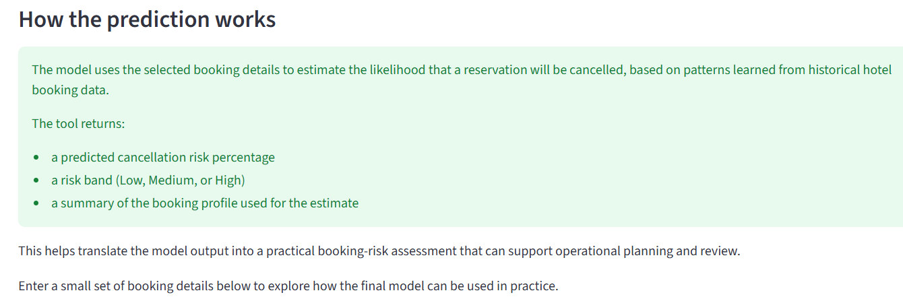 |

The page explains that the model uses selected booking details to
estimate the likelihood that a reservation will be cancelled. It also
makes clear that the tool returns:

- a predicted cancellation risk percentage  
- a risk band (**Low**, **Medium**, or **High**)  
- a summary of the booking profile used for the estimate  

This introductory section helps the user understand the purpose of the
tool before interacting with it and makes the page more accessible to
non technical users.

#### Booking input details

The booking input section allows the user to enter the details needed for
the prediction.

The image below shows the input area of the Prediction Tool page.

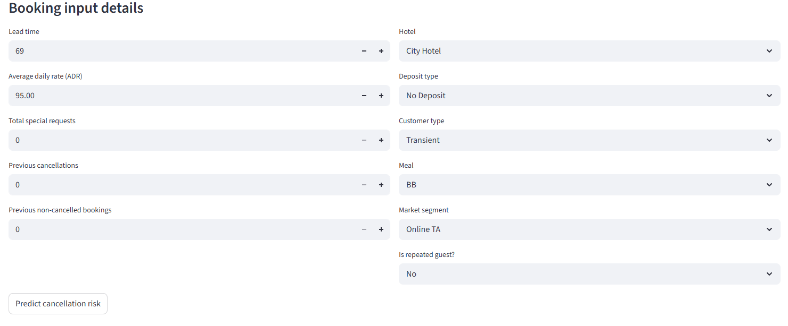

The user can enter or select the following booking details:

- **Lead time**
- **Average daily rate (ADR)**
- **Total special requests**
- **Previous cancellations**
- **Previous non-cancelled bookings**
- **Hotel**
- **Deposit type**
- **Customer type**
- **Meal**
- **Market segment**
- **Is repeated guest?**

This section demonstrates that the live application is properly
aligned with the final model. The tool only asks for realistic,
deployment ready inputs and does not rely on features
that would be unavailable in a real world setting.

#### Prediction result

Once the user clicks **Predict cancellation risk**, the page returns a
predicted risk percentage and a risk band. This gives the user a clear,
practical summary of the model output.

The image below shows an example prediction result.

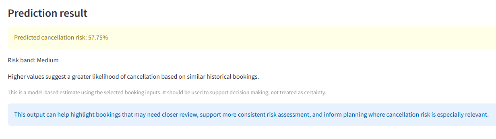

In this example, the tool returned:

- **Predicted cancellation risk:** 57.75%
- **Risk band:** Medium

This section translates the model output into a format
that is easy to understand. Instead of only returning a technical
score, the predictive tool presents the result in a way that supports 
practical decision making.

This page also explains that higher values suggest a greater likelihood
of cancellation based on similar historical bookings. It reinforces that
the output should be treated as decision support rather than certainty.

#### What this means

Below the main result, the page provides a short interpretation section
to help the user understand what the prediction means in context.

The image below shows the interpretation section.

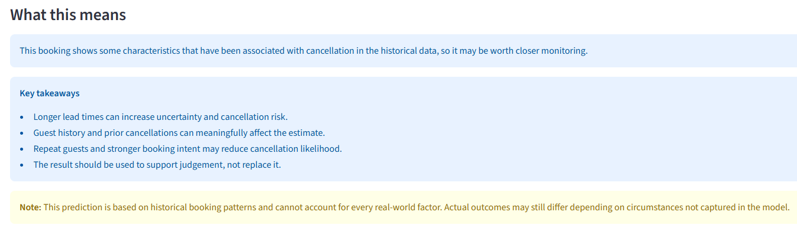

This section adds practical value because it goes beyond showing a score
and helps explain the reasoning in plain English. It highlights the below:

- longer lead times can increase uncertainty and cancellation risk. 
- guest history and prior cancellations can affect the estimate. 
- repeat guests and stronger booking intent may reduce cancellation likelihood.
- the result should be used to support judgement, not replace it. 

A note is also included to remind the user that the prediction is based
on historical patterns and cannot capture every real world factor. This
was important for maintaining appropriate interpretation of the model
itself and to show project limitations.

#### Selected booking profile

The final part of the page shows a summary of the booking profile used to
generate the prediction. This improves transparency by allowing the user
to review the exact inputs behind the estimate.

The image below shows the selected booking profile summary.

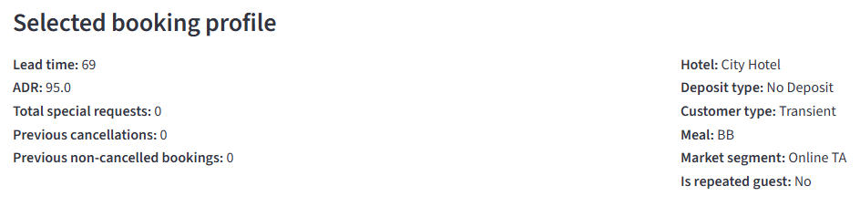 

This section is helpful because it gives the user a clear record of the
selected inputs and makes the prediction more transparent and easier to
double check.

The **Prediction Tool** page shows how the final predictive
model can be used in practice. It combines user input, model output, and
simple interpretation in one place, making the application more
useful, understandable, and aligned with the practical goals of the
project.

### Model Performance

The **Model Performance** page explains how the final cancellation model was
evaluated and highlights the main evidence used to judge its performance.

It brings together the key model assessment outputs, which includes the prediction
pipeline steps, feature importance, confusion matrix, classification report,
and additional diagnostic plots for the selected **Gradient Boosting** model.

This page is important because it shows not only that the predictive model
could make predictions, but also that the final model was evaluated properly,
generalised well to unseen data, and remained aligned with the overall project
objective of supporting cancellation risk assessment.

#### Model Performance - page introduction

In the below image, the opening section of the **Model Performance** page can
be seen. This section introduces the purpose of the page and explains that the
final model is evaluated using several different forms of evidence, rather than
relying on one single metric alone.

| Model Performance - page introduction |
|---|
| 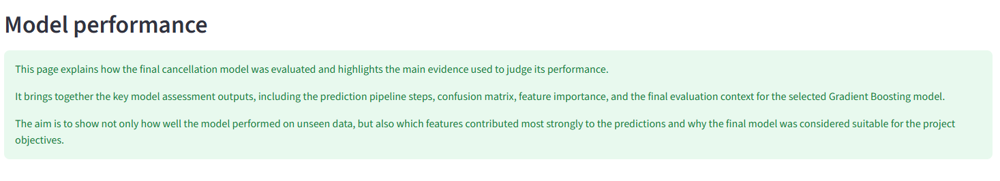 |

---

#### ML Pipeline Steps

The **ML Pipeline Steps** section explains how the final prediction workflow is
structured. It shows how the process begins with data cleaning and feature
engineering, before moving into the trained Gradient Boosting classification
model.

This helps demonstrate that the predictive workflow is structured
and reproducible. It also shows that the deployed application uses
the same cleaned and deployment aligned feature structure as the trained model,
which helps keep predictions consistent and reliable.

| ML Pipeline Steps |
|---|
| 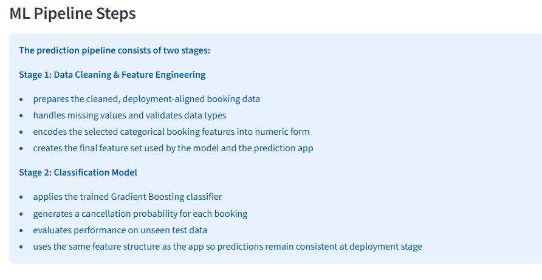 |

The pipeline is split into two stages. The first stage prepares the cleaned
booking data, handles data quality issues, and converts selected categorical
inputs into the encoded feature structure used for modelling. The second stage
applies the trained Gradient Boosting classifier and generates a cancellation
probability for each booking.

This shows that the predictive tool is not simply displaying a model output in
isolation. Instead, it is supported by a defined workflow that connects
preprocessing, modelling, and deployment in a consistent way.

---

#### Feature Importance

The **Feature Importance** section shows which booking variables contributed
most strongly to the final Gradient Boosting model.

This is important because it helps explain why the model makes its
predictions, rather than only showing the final performance scores. It gives
useful insight into the booking characteristics that appear most closely linked
to cancellation behaviour in the historical data.

| Feature Importance |
|---|
| 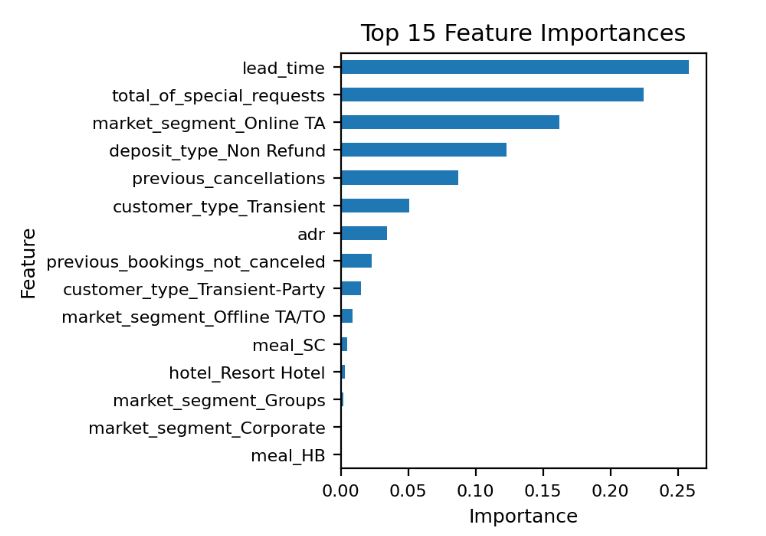 |

The chart shows that **lead time** was the most influential feature in the
final model, followed by variables such as **total special requests**,
**market segment**, **deposit type**, and **previous cancellations**.

Lead time reflects booking uncertainty, deposit type reflects commitment,
and previous cancellation behaviour provides historical context about
customer reliability. This helps support the project objective of using
historical booking behaviour to identify reservations that may be at greater
risk of cancellation.

---

#### Train and Test Performance Summary

The **Model Performance Summary** section compares the final model’s results on
the training set and the test set. This helps assess both predictive
performance and generalisation.

A strong project outcome is not just a good training score, but a model that
also performs well on unseen data. For this reason, comparing train and test
results is important when deciding whether the final model is suitable for
deployment.

| Train and Test Performance Summary |
|---|
| 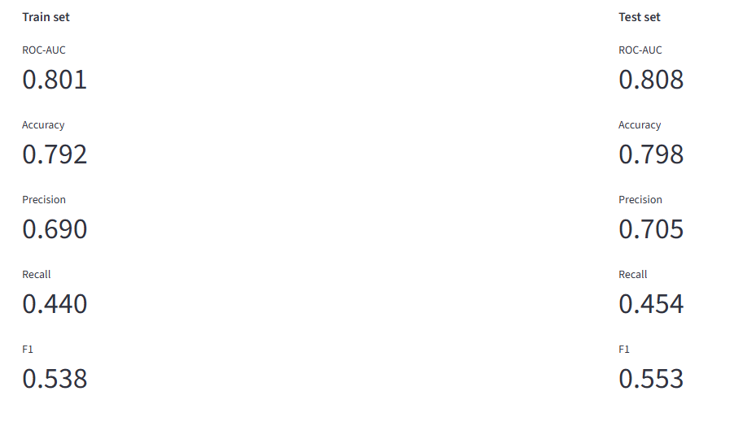 |

The train and test results are close across the main metrics, which suggests
that the final **Gradient Boosting** model generalises reasonably well and is
not showing the stronger overfitting that was seen earlier with Random Forest.

The final **test set** results were:

- **ROC-AUC:** 0.808  
- **Accuracy:** 0.798  
- **Precision:** 0.705  
- **Recall:** 0.454  
- **F1 Score:** 0.553  

These results support the decision to select Gradient Boosting as the final
model. In particular, the ROC-AUC score shows good ranking ability, while the
F1 Score shows a reasonable balance between precision and recall. The lower
recall also highlights that some cancellations are still missed, which is why
the tool should be treated as decision support rather than certainty.

---

#### Confusion Matrix

The **Confusion Matrix** section shows how the final model performed on unseen
test data by comparing the predicted booking outcome against the true outcome.

In this project, **class 0** represents bookings that were **not cancelled**
and **class 1** represents bookings that **were cancelled**.

| Confusion Matrix |
|---|
| 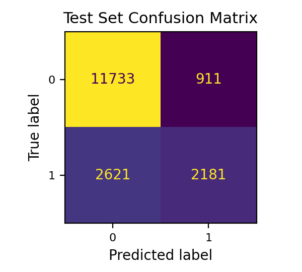 |

The matrix shows that the model correctly identified a large number of
non-cancelled bookings (**11,733**) and also correctly identified **2,181**
cancelled bookings. However, it also missed **2,621** cancellations, which
helps explain why recall for the cancellation class is more moderate.

This gives a more practical view of model behaviour than a single
score alone. It shows that the final model is stronger at identifying
bookings that are likely to go ahead, while still providing useful support for
highlighting higher risk bookings.

---

#### Classification Report

The **Classification Report** provides a more detailed breakdown of precision,
recall, and F1-score for each class.

| Classification Report |
|---|
| 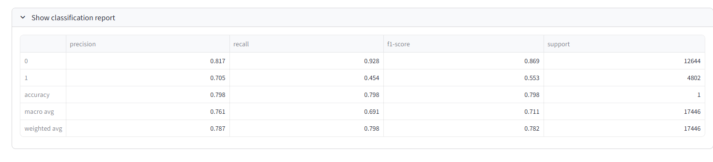 |

The report shows that the model performs more strongly for **class 0**, with a
recall of **0.928**, meaning it is very effective at identifying bookings that
are likely to go ahead. For **class 1**, precision is **0.705** and recall is
**0.454**, showing that while many predicted cancellations are correct, the
model still misses a notable portion of actual cancellations.

This is an important point in the context of the project. It shows that the
model has useful predictive value, but it is not perfect. It performs well
overall, with an accuracy of **0.798**, yet remains better at recognising
stable bookings than cancelled ones. This supports the decision to frame the
tool as a practical decision support system rather than a guaranteed forecasting
solution.

---

#### Diagnostic Plots

The **Diagnostic Plots** section provides two additional views of the final
model using unseen test data: the **ROC Curve** and the
**Precision-Recall Curve**.

These plots help evaluate performance beyond the headline metrics and show how
well the model separates cancelled and non-cancelled bookings across different
decision thresholds.

##### ROC Curve

| ROC Curve |
|---|
| 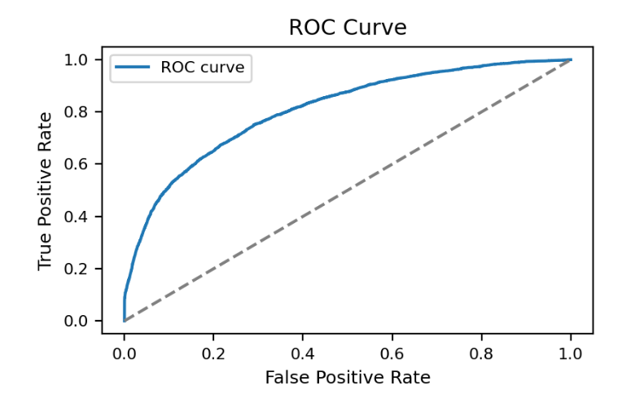 |

The ROC curve shows the trade off between the true positive rate and the false
positive rate across threshold settings. In this project, the curve supports
the final **ROC-AUC score of 0.808**, indicating that the model has good
overall ability to distinguish between cancelled and non-cancelled bookings.

This matters because the predictive tool returns a probability based risk score,
so it is important that the model can rank higher risk and lower risk bookings
effectively across different cut off points.

##### Precision-Recall Curve

| Precision-Recall Curve |
|---|
| 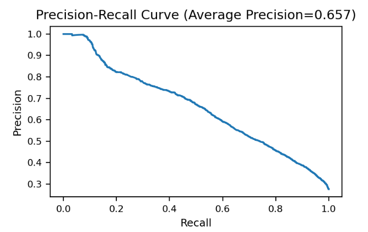 |

The Precision-Recall curve shows how precision changes as recall increases,
helping to visualise the trade off between catching more cancellations
and introducing more false positives.

The average precision score of **0.657** suggests that the model maintains a
useful level of precision as recall increases, although performance weakens as
the model tries to identify more cancelled bookings. Taken together with the
ROC curve, this supports the conclusion that the final model is well balanced,
while still involving trade offs that need to be interpreted carefully.

---

#### Business Interpretation

The final model produces a **cancellation-risk probability** that can support
decision making rather than act as certainty.

In a real hotel setting, higher risk bookings could potentially be flagged for
closer review, reminder messages, deposit enforcement, or other
actions to reduce the likelihood or impact of cancellations. This helps
demonstrate the practical value of predictive analytics within a business
context.

The evaluation results show that the final Gradient Boosting model is
strong enough to support the project objective of identifying higher risk
bookings in a structured and evidence-based way.

---

#### Limitations

Although the final model performed well overall, some limitations remain.

- Predictions are based on historical booking behaviour and may become less
  reliable if real world patterns change over time.
- The model does not capture every possible real world influence on
  cancellation behaviour.
- Recall for cancelled bookings is moderate, meaning that some cancellations
  are still missed.
- The output should therefore be treated as a **probability-based support
  tool**, not as a guarantee of what will happen in any individual case.

These limitations are important because they reinforce the correct use of the
tool: it can support better judgement and more informed planning, but it should
not replace human interpretation.

### Business Conclusions

The **Business Conclusions** page explains the final practical
meaning of the project and explains what the predictive tool could
support in a real booking context.

This page shows how the final findings can be translated into
decision making value. Rather than stopping at technical
performance, the page explains what the results may mean for a business
that wants to assess cancellation risk in a more structured way.

The page also reinforces an important point seen throughout the tool:
the final model can support judgement, but it should not be treated as a
certainty system.

#### Business Conclusions - page introduction

The image below shows the opening section of the **Business Conclusions**
page. This introduction gives the user a clear overview of the main
items covered on the page, including cancellation risk patterns,
practical use of the tool, decision support, and responsible
interpretation.

| Business Conclusions - page introduction |
|---|
| 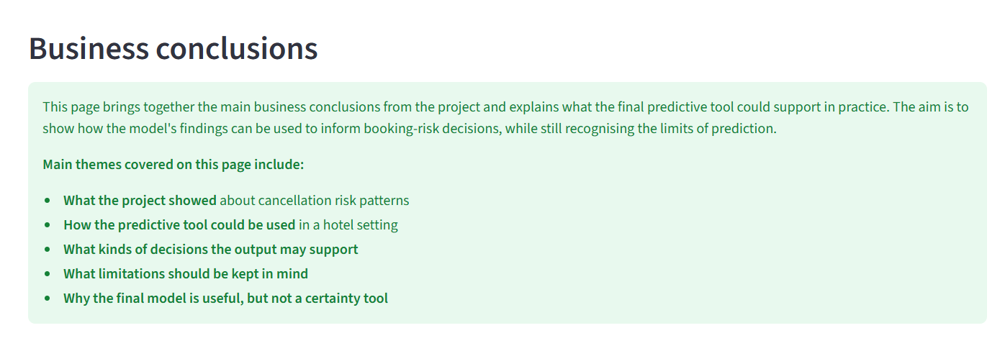 |

This opening section is useful because it prepares the user for the
final interpretation stage of the dashboard and makes it clear that the
page is focused on practical meaning, not just technical outputs.

#### Practical use of the predictive tool

This section xplains how the final predictive tool could be used in a hotel
setting to support more focused review of higher-risk bookings.

The image below shows the **Practical use of the predictive tool**
section.

| Practical use of the predictive tool |
|---|
| 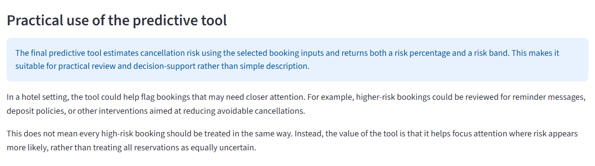 |

This section links the model output to realistic business use.
It explains that the predicitve tool could help highlight bookings
that may need closer attention, such as bookings that might benefit from
reminder messages, deposit policies, or other interventions aimed at
reducing cancellations.

It also makes it clear that the predicitve tool is not meant to treat every 
higher risk booking in the same way. Instead, its value lies in helping a business
focus attention where risk appears more likely, rather than treating all
bookings as equally uncertain.

#### What the results suggest for decision making

This section focuses on what the final results mean for business
decision making.

The image below shows the **What the results suggest for
decision-making** section.

| What the results suggest for decision-making |
|---|
| 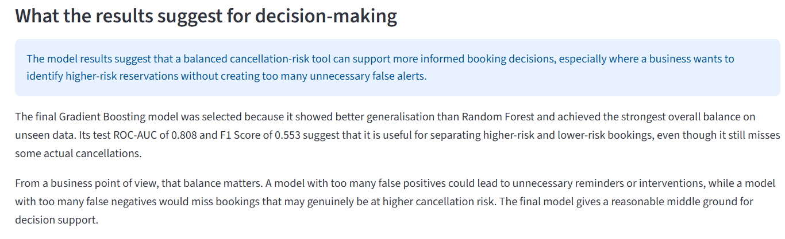 |

This section strengthens the practical interpretation of the tool by
explaining why the final model balance matters. It shows that a useful
cancellation risk tool must identify higher risk bookings without
creating too many unnecessary false alerts.

This is especially relevant in a business setting, because false
positives could lead to unnecessary interventions, while false
negatives could mean missing bookings that may genuinely be at
greater cancellation risk. The page therefore helps explain why
**Gradient Boosting** was the most suitable final choice: it provided a
reasonable middle ground for decision support on unseen data.

The **Business Conclusions** page helps show that the final
predictive tool has practical value beyond the modelling stage. It
brings together the key findings from the project and presents them in a
way that is more relevant to real booking risk review, while still keeping
the interpretation responsible and evidence based.

## Technologies Used

### Languages

| Technology | Purpose |
|---|---|
| Python | Main programming language for the predictive analytics workflow and deployed application |
| Markdown | Project documentation and README writing |

### Frameworks, Libraries, and Packages

| Technology | Purpose |
|---|---|
| Pandas | Data cleaning, exploration, and manipulation |
| NumPy | Numerical operations |
| Matplotlib | Static charts and model evaluation plots |
| Plotly | Interactive dashboard visualisations |
| scikit-learn | Preprocessing, train/test splitting, model training, and performance evaluation |
| Joblib | Saving and loading the trained model |
| Streamlit | Building and deploying the interactive dashboard |

### Development Tools and Platforms

| Technology | Purpose |
|---|---|
| Jupyter Notebook | Exploratory analysis, feature engineering, and model development |
| VS Code | Main code editor |
| Git | Version control |
| GitHub | Repository hosting |
| GitHub Projects | Agile planning with epics and user stories |
| Heroku | Live deployment of the application |

### Validation and Testing Tools

| Technology | Purpose |
|---|---|
| Code Institute Python Linter (PEP8CI) | Python code validation for `app.py` |

### Dataset Source

The **Hotel Booking Demand** dataset was accessed through **Kaggle**
and used as the data source for the predictive tool.

## Agile Methodology
The GitHub Projects board used to plan and track development can be
viewed [here](https://github.com/users/moranjohn-95/projects/11).

This predictive analyitcs project was planned and tracked using GitHub Projects
boards. The board was used to organise the work into epics and user
stories so that development could be broken into smaller and more manageable
steps.

The workflow was structured using the below columns:

- **Epics**
- **Todo**
- **In Progress**
- **Testing / In Review**
- **Done**

This helped track the work from early planning through development,
testing, and completion.

### Epics and User Stories

The board was built around six main epics:

- Project Planning & Business Understanding
- Exploratory Data Analysis & Hypothesis Validation
- Data Cleaning & Feature Engineering
- Model Training, Comparison & Final Selection
- Dashboard & Prediction Tool Development
- Testing, Deployment & Documentation

Each epic was then broken down into smaller user stories linked to the
main parts of the tool, such as dataset selection, exploratory
analysis, hypothesis validation, model comparison, prediction, and final
deployment.

All user stories for this tool were labelled as **must-have** because
they were directly linked to the predictive analytics workflow and
the final deployed dashboard.

### Agile Board Progression

The images below show how the board was used during development and how
the work moved through the different stages over time from the left (in progress) to the right (final state).

| In-progress board view | Final board state |
|---|---|
|  |  |

### How the Board Was Used

The board was updated throughout development as work progressed across
the project. Items were moved between columns to reflect their current
status, helping to show what had been planned, what was being worked on,
what was under review, and what had been completed.

This approach helped keep the workflow clear and supported a more
structured development process, rather than building the tool in an
unplanned way.

### Why This Was Useful

Using an agile board proved to be useful because it made the development process
easier to manage and review. It helped break the work into clear stages,
kept the main priorities visible and supported steady progress across
the full workflow.

It also provided a clear record of how the tool moved from planning and
analysis into modelling, dashboard development, testing, deployment, and
documentation.

## Testing

The below section discusses the testing carried out during and after the
development of the hotel booking predictive analytics tool.

### Python Code Validation (CI Python Linter)

The custom Python code used in the deployed application was tested using
the **Code Institute Python Linter (PEP8CI)** to confirm that the main
application file is readable, maintainable, and free from syntax or
formatting errors.

The purpose of this testing was to confirm that:

- Python code follows PEP8 styling conventions.
- there are no syntax or indentation errors.
- the deployed application file meets Code Institute assessment
  expectations.

For this project, **app.py** was the only custom tracked Python source
file used in the deployed predictive tool. Notebook files were not
included in this part of testing because they are not part of the live
application file structure in the same way.

All tested files returned **All clear, no errors found**.

#### Python Files Tested

| App / Area | File | Validator Confirmation | Result |
|---|---|---|---|
| Streamlit Dashboard | `app.py` | CI Python Linter | No errors |

#### Evidence

#### Python Testing Summary

- `app.py` passed the Code Institute Python Linter.
- no PEP8 errors or warnings were reported.
- the deployed dashboard file is readable and properly formatted.

---

### Manual Testing

Manual testing was carried out throughout development to confirm that
the dashboard behaved as expected and that the main features worked
correctly in both local development and the deployed version.

Testing focused on:

- page navigation
- chart visibility
- content layout
- model comparison content
- prediction tool behaviour
- risk output and risk band display
- model performance evidence
- business conclusions and limitations
- live deployment checks

All manually tested features behaved as intended, with no critical
issues found in the final deployed version.

#### Manual Testing Summary Table

| Feature Area | Test Action | Expected Result | Outcome |
|---|---|---|---|
| Sidebar Navigation | Click each page in the sidebar | Correct page loads without error | Pass |
| Quick Project Summary | Open the summary page | Tool purpose, dataset, workflow, and final model summary are shown correctly | Pass |
| Project Hypotheses and Validation | Open the hypotheses page | Each hypothesis is displayed with verdict, interpretation, and supporting chart option | Pass |
| EDA Insights | Open the EDA page and expand chart sections | Key findings and related charts display correctly | Pass |
| Model Comparison | Open the model comparison page | Comparison table and model evaluation summaries are shown clearly | Pass |
| Model Comparison | Review final model section | Gradient Boosting is shown as the final selected model | Pass |
| Prediction Tool | Enter valid booking inputs and run prediction | A cancellation-risk percentage and risk band are returned | Pass |
| Prediction Tool | Change booking inputs and run prediction again | The output updates correctly based on the selected inputs | Pass |
| Prediction Tool | Review selected booking profile section | Input summary matches the selected values used in the prediction | Pass |
| Model Performance | Open the model performance page | Metrics, feature importance, confusion matrix, and diagnostic sections load correctly | Pass |
| Model Performance | Expand classification report | Classification report appears correctly and matches the final model output | Pass |
| Business Conclusions | Open the business conclusions page | Practical use, limitations, and final conclusion are shown clearly | Pass |
| Live Deployment | Open the Heroku app | The deployed dashboard loads successfully online | Pass |
| Live Deployment | Test multiple pages on the live app | Pages load and function correctly in deployment | Pass |

#### Manual Testing Conclusion

Manual testing confirmed that:

- all main dashboard pages load correctly
- the prediction tool returns a valid output
- content and interpretation match the final deployed model
- the deployed app is stable and usable

---

### Prediction Tool and Model Validation

Additional checks were carried out to make sure the dashboard remained
properly aligned with the final deployed model.

This was important because the predictive tool was updated during
development to ensure that the live app only used realistic and
actual deployed input features.

The following checks were completed:

- the final deployed model used in the app is **Gradient Boosting**.
- the app inputs match the final deployed feature set.
- prediction output is based on the cancellation class probability.
- the displayed risk band matches the returned prediction score.
- final metrics shown in the dashboard match the selected final model.
- model interpretation text reflects the final workflow and results.

These checks confirmed that the dashboard was not only functional, 
but also technically aligned with the final model used in deployment.

---

### User Story Testing

User stories were also tested to confirm that all acceptance criteria were met. 
The table below summarises each user stories used for this application
and the evidence supporting each one.

| User Story | Result | Evidence |
|---|---|---|
| **As the software engineer, I want to define the cancellation-risk problem. So that the predictive tool is built around a clear business need.** | Pass | Quick Project Summary page / README Project Overview |
| **As the software engineer, I want to select a suitable dataset. So that the predictive tool can be built on relevant historical booking data.** | Pass | Quick Project Summary page / README Dataset Content |
| **As a user, I want to review cancellation patterns in the data. So that I can understand the main behavioural signals before modelling.** | Pass | EDA Insights page |
| **As a user, I want to validate the main project hypotheses. So that I can see whether the key assumptions were supported by the data.** | Pass | Project Hypotheses and Validation page |
| **As the software engineer, I want to prepare clean modelling data. So that the final predictive tool uses realistic and reliable inputs.** | Pass | Model Performance page / README workflow sections |
| **As a user, I want to compare the models tested. So that I can understand how the final model was selected.** | Pass | Model Comparison page |
| **As a user, I want the deployed model to be the one that gives the best overall balance on unseen data. So that the predictive tool is reliable in practice.** | Pass | Quick Project Summary / Model Comparison / deployed app |
| **As a user, I want the dashboard to be easy to use. So that I can move through the tool clearly and understand the outputs.** | Pass | Full deployed dashboard |
| **As a user, I want to add booking details and receive a cancellation-risk estimate. So that I can assess booking risk in a practical way.** | Pass | Prediction Tool page |
| **As a user, I want to review business conclusions. So that I can understand the practical use and limitations of the tool.** | Pass | Business Conclusions page |

User story testing confirmed that the planned features were
implemented and worked as expected in the final predictive tool.

---

### Deployment Testing

After deployment to Heroku, the live version of the application was
tested to confirm that the dashboard worked correctly outside the local
development environment.

The deployed application was checked for the following:

- successful app loading.
- correct sidebar navigation.
- working page content across the dashboard.
- successful loading of the final model file.
- successful prediction output from the live prediction tool.

Testing after deployment confirmed that the live application behaved as
expected and that the final dashboard was accessible and functional in
its deployed environment.

---

### Testing Conclusion

Testing showed that the final predictive analytics dashboard is stable,
consistent, and aligned with the final deployed model.

## Bugs

### Resolved Issues

During development, a number of issues were found and fixed as the tool
was improved. The table below summarises the main problems that came up
and how they were resolved.

| Bug / Issue | Cause | Fix | Status |
|---|---|---|---|
| App inputs did not fully match the final model | Earlier versions of the app still reflected a wider feature set than the final deployed model | The prediction inputs were updated so the app only used the final deployment aligned features | Resolved |
| Some unsuitable fields were still present in earlier modelling stages | A few fields were not realistic for deployment or risked leaking outcome information | These fields were removed and a cleaned deployment ready dataset was created | Resolved |
| Final model references were not fully updated across the app | Some content still reflected earlier model choices after Gradient Boosting became the final model | The dashboard wording and related sections were updated so the final model was shown consistently throughout | Resolved |
| Page styling became inconsistent during content updates | Sections were added and revised page by page, which caused some formatting differences | Intro boxes, section dividers, and explanation blocks were standardised across the dashboard | Resolved |
| Heroku deployment files were missing at the start | The repository did not yet include the files needed for Heroku deployment | A `Procfile` and `.python-version` file were added and the app was prepared properly for deployment | Resolved |
| A Windows only dependency was still in the requirements file | The requirements list included a package that was not suitable for Linuxb ased deployment | The deployment requirements were reviewed and the unsuitable dependency was removed | Resolved |

## Deployment

### Heroku

The application is deployed on **Heroku**.

**Live App:** [Hotel Booking Analytics](https://hotel-booking-analytics-25ff54f64cf5.herokuapp.com/)

### Deployment Steps

#### Create the Heroku App

1. Log in to the **Heroku Dashboard**
2. Click **New** → **Create new app**
3. Enter an app name
4. Select the region (**Europe** was used for this project)
5. Click **Create app**

#### Connect the GitHub Repository

1. Open the **Deploy** tab in Heroku
2. Select **GitHub** as the deployment method
3. Connect the GitHub account if prompted
4. Search for the repository:
   - `hotel-booking-predictive-analytics`
5. Click **Connect**

#### Deploy the Application

1. Scroll to the **Manual deploy** section
2. Select the `main` branch
3. Click **Deploy Branch**
4. Wait for the build to complete
5. Open the live app once deployment finishes

### Configuration Files

| File | Purpose |
|---|---|
| `Procfile` | Defines the Heroku start command for the Streamlit app |
| `.python-version` | Specifies the Python version used for deployment |
| `requirements.txt` | Lists the Python packages needed to run the app |

### Local Development

#### Prerequisites

- Python 3.12 or a similar compatible version
- Git
- A virtual environment tool such as `venv`

#### Clone the Repository

    git clone https://github.com/moranjohn-95/hotel-booking-predictive-analytics
    cd hotel-booking-predictive-analytics

#### Create and Activate a Virtual Environment

    python -m venv venv

**Mac / Linux**

    source venv/bin/activate

**Windows**

    venv\Scripts\activate

#### Install Dependencies

    pip install -r requirements.txt

#### Run the Application

    streamlit run app.py

### Forking the Repository

1. Go to the GitHub repository
2. Click the **Fork** button in the top right corner
3. This creates a copy of the repository under your GitHub account

### Clone Your Fork

    git clone https://github.com/YOUR-USERNAME/hotel-booking-predictive-analytics
    cd hotel-booking-predictive-analytics

## Credits

### Dataset

This predictive tool uses the **Hotel Booking Demand** dataset from
**Kaggle**.

The dataset contains booking records for both a **City Hotel** and a
**Resort Hotel**, and was used as the basis for the exploratory
analysis, hypothesis validation, and machine learning workflow in this
tool.

The dataset is based on the **Hotel Booking Demand Datasets** research
work by **Nuno Antonio, Ana de Almeida, and Luis Nunes**.

### Documentation and References

The following resources were used during development:

| Resource | Usage |
|---|---|
| [Streamlit Documentation](https://docs.streamlit.io/) | Dashboard development |
| [scikit-learn Documentation](https://scikit-learn.org/stable/) | Model training, preprocessing, and evaluation |
| [Pandas Documentation](https://pandas.pydata.org/docs/) | Data handling and analysis |
| [NumPy Documentation](https://numpy.org/doc/) | Numerical operations |
| [Matplotlib Documentation](https://matplotlib.org/stable/) | Static visualisations |
| [Plotly Documentation](https://plotly.com/python/) | Interactive charts |
| [Joblib Documentation](https://joblib.readthedocs.io/en/latest/) | Model serialisation and loading |
| [Heroku Documentation](https://devcenter.heroku.com/) | Deployment guidance |
| [Code Institute Python Linter](https://pep8ci.herokuapp.com/) | Python code validation |

### Tools Used

| Tool | Purpose |
|---|---|
| VS Code | Code editor |
| Jupyter Notebook | Exploratory analysis and modelling |
| Git | Version control |
| GitHub | Repository hosting |
| GitHub Projects | Agile project planning |
| Heroku | Cloud deployment |

## Acknowledgements

- **Code Institute** for the learning materials and project brief.
- The creators of the **Hotel Booking Demand** dataset on kaggle for making the
  data available for analysis.